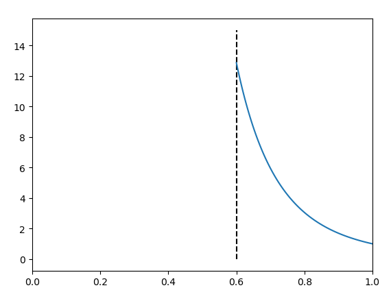
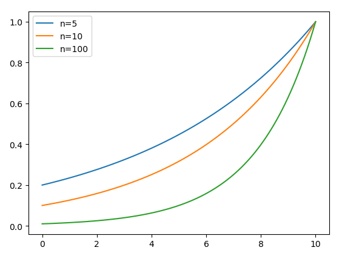

# Assignment 1

​																						2020E8017782051  黎郡

## Question 1

Let x have a uniform density
$$
p(x \mid \theta) \sim U(0, \theta)=\left\{\begin{array}{cc}
1 / \theta & 0 \leq x \leq \theta \\
0 & \text { otherwise }
\end{array}\right.
$$
1. Suppose that $n$ samples $D=\left\{x_{1}, \ldots, x_{n}\right\}$ are drawn independently according to $\mathrm{p}(\mathrm{x} \mid \theta)$. Show that the maximum likelihood estimate for $\theta$ is $\max [\mathrm{D}]$, i.e., the value of the maximum element in D.
2. Suppose that $\mathrm{n}=5$ pointers are drawn from the distribution and the maximum value of which happens to be $\max _{\mathrm{k}} \mathrm{x}_{\mathrm{k}}=0.6 .$ Plot the likelihood $\mathrm{p}(\mathrm{x} \mid \theta)$ in the range $0 \leq$ $\theta \leq 1 .$ Explain in words why you do not need to know the values of the other four points.

### Answer 1

1. 证明对于 $\theta$ 的最大似然估计就是$D{\text中的}\max [\mathrm{D}]$

   根据题意可知x服从均匀分布
   $$
   p(x \mid \theta)=\left\{\begin{array}{cc}
   1 / \theta & 0 \leq x \leq \theta \\
   0 & \text { otherwise }
   \end{array}\right.
   $$
   引入指示函数$I(\cdot),$利用指示函数$I(\cdot)$来代表$x$是否属于某个集合。如果属于集合则值为1，否则为0：
   $${\displaystyle I_{A}(x)={\begin{cases}1 ,若x\in A\\
   0,若x\notin A
   \end{cases}}\quad }$$
   
   引入指示函数$I(\cdot)$后，最大似然如下：
$$
\begin{aligned}
   p(\mathcal{D} \mid \theta) &=\prod_{k=1}^{n} p\left(x_{k} \mid \theta\right) \\
   &=\prod_{k=1}^{n} \frac{1}{\theta} I\left(0 \leq x_{k} \leq \theta\right) \\
   &=\frac{1}{\theta^{n}} I\left(\theta \geq \max _{k} x_{k}\right) I\left(\min _{k} x_{k} \geq 0\right)
   \end{aligned}
$$
如果$\theta$比 $x_{k} $ 的最大值小，那么当 $\theta \geq \max _{k} x_{k}$的时候，$I(\cdot)$等于0。且$1 / \theta^{n}$会随着 $\theta$的增加而逐渐减小，所以最大似然函数在$\hat{\theta}=\max _{k} x_{k}$取地最大值。

2. 如图所示：

   

## Question 2

Assume we have training data from a Gaussian distribution of known covariance Σ but unknown mean μ. Suppose further that this mean itself is random, and characterized by a Gaussian density having mean m0 and covariance Σ0. 

1. What is the MAP estimator for μ? 
2.  Suppose we transform our coordinates by a linear transform x′ = Ax, for non singular matrix A, and accordingly for other terms. Determine whether your MAP estimator gives the appropriate estimate for the transformed mean μ′. Explain. 

### Answer 2

1. 均值$\mu$的MAP最大后验估计是什么？

   求$\mu$的最大后验概率就是求令$l(\boldsymbol{\mu}) p(\boldsymbol{\mu})$取最大值的参数向量$\mu$。因此我们可以根据公式列出如下式子：

$$
l(\boldsymbol{\mu}) p(\boldsymbol{\mu})=\ln [p(\mathcal{D}\mid \boldsymbol{\mu}) p(\boldsymbol{\mu})]
$$

根据题意可知训练样本符合高斯分布，所以

$$
\begin{array}
\l ln [p(\mathcal{D} \mid \boldsymbol{\mu})]&=\ln \left(\prod_{k=1}^{n} p\left(\mathbf{x}_{k} \mid \boldsymbol{\mu}\right)\right)\\

&=\sum_{k=1}^{n} \ln \left[p\left(\mathbf{x}_{k} \mid \boldsymbol{\mu}\right)\right] \\

&\because p\left(\mathbf{x}_{k} \mid \boldsymbol{\mu}\right)=\frac{1}{(2 \pi)^{d / 2}|\mathbf{\Sigma}|^{1 / 2}} \exp \left[-\frac{1}{2}(\mathbf{x}-\boldsymbol{\mu})^{t} \mathbf{\Sigma}^{-1}(\mathbf{x}-\boldsymbol{\mu})\right]\\

&\therefore \ln p\left(\mathbf{x}_{k} \mid \boldsymbol{\mu}\right)=-\frac{1}{2} \ln \left[(2 \pi)^{d}|\mathbf{\Sigma}|\right]-\frac{1}{2}\left(\mathbf{x}-\boldsymbol{\mu}\right)^{t} \mathbf{\Sigma}^{-1}\left(\mathbf{x}-\boldsymbol{\mu}\right)\\
即：\\
ln [p(\mathcal{D} \mid \boldsymbol{\mu})]&=-\frac{n}{2} \ln \left[(2 \pi)^{d}|\mathbf{\Sigma}|\right]-\sum_{k=1}^{n} \frac{1}{2}\left(\mathbf{x}_{k}-\boldsymbol{\mu}\right)^{t} \mathbf{\Sigma}^{-1}\left(\mathbf{x}_{k}-\boldsymbol{\mu}\right)
\end{array}
$$

并且均值$\mu$本身是随机取值，服从均值为$m_0$，协方差为$\Sigma_0$的高斯分布，所以$p(\mu)$表示如下：
$$
\begin{aligned}
&p(\boldsymbol{\mu})=\frac{1}{(2 \pi)^{d / 2}\left|\mathbf{\Sigma}_{0}\right|^{1 / 2}} \exp \left[-\frac{1}{2}\left(\boldsymbol{\mu}-\mathbf{m}_{0}\right)^{t} \mathbf{\Sigma}_{o}^{-1}\left(\boldsymbol{\mu}-\mathbf{m}_{0}\right)\right]\\
&\text{同样对}p(\boldsymbol{\mu})取\ln得：\\
&\ln[p(\boldsymbol{\mu})]=-\frac{1}{2} \ln \left[(2 \pi)^{d}|\mathbf{\Sigma_{0}}|\right]-\frac{1}{2}\left(\mathbf{\mu}-\mathbf{m}_{0}\right)^{t} \mathbf{\Sigma_{0}}^{-1}\left(\mathbf{\mu}-\mathbf{m}_{0}\right)\\
\end{aligned}
$$
所以对于均值$\mu$的MAP估计就是求下面式子的最大值：
$$
\begin{aligned}
\hat{\boldsymbol{\mu}}=& \arg \max _{\boldsymbol{\mu}}\left\{\left[-\frac{n}{2} \ln \left[(2 \pi)^{d}|\boldsymbol{\Sigma}|\right]-\sum_{k=1}^{n} \frac{1}{2}\left(\mathbf{x}_{k}-\boldsymbol{\mu}\right)^{t} \boldsymbol{\Sigma}^{-1}\left(\mathbf{x}_{k}-\boldsymbol{\mu}\right)\right]\right. \\
&\left.+
\left[
-\frac{1}{2} \ln \left[(2 \pi)^{d}|\mathbf{\Sigma_{0}}|\right]-\frac{1}{2}\left(\mathbf{\mu}-\mathbf{m}_{0}\right)^{t} \mathbf{\Sigma_{0}}^{-1}\left(\mathbf{\mu}-\mathbf{m}_{0}\right)
\right]
\right\}
\end{aligned}
$$

2. 假设使用线性变化来变化坐标$x^{'}=Ax$,其中A为非奇异矩阵。那么MAP能过对变换以后的$\mu^{'}$做出正确的估计吗？

   假设进行线性变化后的均值很方差分别为$\mu^{'}$和$\Sigma^{'}$，根据$x^{'}=Ax$可以计算得$\mu^{'}$和$\Sigma^{'}$得值如下：

$$
\boldsymbol{\mu}^{\prime}=\mathcal{E}\left[\mathbf{x}^{\prime}\right]=\mathcal{E}[\mathbf{A} \mathbf{x}]=\mathbf{A} \mathcal{E}[\mathbf{x}]=\mathbf{A} \boldsymbol{\mu}
$$

$$
\begin{aligned}
   \boldsymbol{\Sigma}^{\prime} &=\mathcal{E}\left[\left(\mathbf{x}^{\prime}-\boldsymbol{\mu}^{\prime}\right)\left(\mathbf{x}^{\prime}-\boldsymbol{\mu}^{\prime}\right)^{t}\right] \\
   &=\mathcal{E}\left[\left(\mathbf{A} \mathbf{x}^{\prime}-\mathbf{A} \boldsymbol{\mu}^{\prime}\right)\left(\mathbf{A} \mathbf{x}^{\prime}-\mathbf{A} \boldsymbol{\mu}^{\prime}\right)^{t}\right] \\
   &=\mathcal{E}\left[\mathbf{A}\left(\mathbf{x}^{\prime}-\boldsymbol{\mu}^{\prime}\right)\left(\mathbf{x}^{\prime}-\boldsymbol{\mu}^{\prime}\right)^{t} \mathbf{A}^{t}\right] \\
   &=\mathbf{A} \mathcal{E}\left[\left(\mathbf{x}^{\prime}-\boldsymbol{\mu}^{\prime}\right)\left(\mathbf{x}^{\prime}-\boldsymbol{\mu}^{\prime}\right)^{t}\right] \mathbf{A}^{t} \\
   &=\mathbf{A} \mathbf{\Sigma} \mathbf{A}^{t}
   \end{aligned}
$$
​			将$\mu^{'}$和$\Sigma^{'}$带入最大似然公式中可得:

$$
\begin{aligned}
   \ln \left[p\left(\mathcal{D}^{\prime} \mid \boldsymbol{\mu}^{\prime}\right)\right] &=\ln \left(\prod_{k=1}^{n} p\left(\mathbf{x}_{k}^{\prime} \mid \boldsymbol{\mu}^{\prime}\right)\right) \\
   &=\ln \left(\prod_{k=1}^{n} p\left(\mathbf{A} \mathbf{x}_{k} \mid \mathbf{A} \boldsymbol{\mu}\right)\right) \\
   &=\sum_{k=1}^{n} \ln \left[p\left(\mathbf{A} \mathbf{x}_{k} \mid \mathbf{A} \boldsymbol{\mu}\right)\right] \\
   &=-\frac{n}{2} \ln \left[(2 \pi)^{d}\left|\mathbf{A} \boldsymbol{\Sigma} \mathbf{A}^{t}\right|\right]-\sum_{k=1}^{n} \frac{1}{2}\left(\mathbf{A} \mathbf{x}_{k}-\mathbf{A} \boldsymbol{\mu}\right)^{t}\left(\mathbf{A} \boldsymbol{\Sigma} \mathbf{A}^{t}\right)^{-1}\left(\mathbf{A} \mathbf{x}_{k}-\mathbf{A} \boldsymbol{\mu}\right) \\
   &=-\frac{n}{2} \ln \left[(2 \pi)^{d}\left|\mathbf{A} \boldsymbol{\Sigma} \mathbf{A}^{t}\right|\right]-\sum_{k=1}^{n} \frac{1}{2}\left((\mathbf{x}-\boldsymbol{\mu})^{t} \mathbf{A}^{t}\right)\left(\left(\mathbf{A}^{-1}\right)^{t} \mathbf{\Sigma}^{-1} \mathbf{A}^{-1}\right)\left(\mathbf{A}\left(\mathbf{x}_{k}-\boldsymbol{\mu}\right)\right) \\
   &=-\frac{n}{2} \ln \left[(2 \pi)^{d}\left|\mathbf{A} \boldsymbol{\Sigma} \mathbf{A}^{t}\right|\right]-\sum_{k=1}^{n} \frac{1}{2}\left(\mathbf{x}_{k}-\boldsymbol{\mu}\right)^{t}\left(\mathbf{A}^{t}\left(\mathbf{A}^{-1}\right)^{t}\right) \boldsymbol{\Sigma}^{-1}\left(\mathbf{A}^{-1} \mathbf{A}\right)\left(\mathbf{x}_{k}-\boldsymbol{\mu}\right) \\
   &=-\frac{n}{2} \ln \left[(2 \pi)^{d}\left|\mathbf{A} \boldsymbol{\Sigma} \mathbf{A}^{t}\right|\right]-\sum_{k=1}^{n} \frac{1}{2}\left(\mathbf{x}_{k}-\boldsymbol{\mu}\right)^{t} \mathbf{\Sigma}^{-1}\left(\mathbf{x}_{k}-\boldsymbol{\mu}\right)
   \end{aligned}
$$
​			并且同样的$\boldsymbol{\mu}^{\prime}$本身符合高斯分布，则$p\left(\boldsymbol{\mu}^{\prime}\right)$推导如下：

$$
\begin{aligned}
   p\left(\boldsymbol{\mu}^{\prime}\right) &=\frac{1}{(2 \pi)^{d / 2}\left|\mathbf{\Sigma}_{0}^{\prime}\right|^{1 / 2}} \exp \left[-\frac{1}{2}\left(\boldsymbol{\mu}^{\prime}-\mathbf{m}_{0}\right)^{t} \mathbf{\Sigma}_{0}^{-1}\left(\boldsymbol{\mu}^{\prime}-\mathbf{m}_{0}\right)\right] \\
   &=\frac{1}{(2 \pi)^{d / 2}\left|\mathbf{\Sigma}_{0}^{\prime}\right|^{1 / 2}} \exp \left[-\frac{1}{2}\left(\mathbf{A} \mu-\mathbf{A} \mathbf{m}_{0}\right)^{t}\left(\mathbf{A} \mathbf{\Sigma}_{0} \mathbf{A}^{t}\right)^{-1}\left(\mathbf{A} \boldsymbol{\mu}-\mathbf{A} \mathbf{m}_{0}\right)\right] \\
   &=\frac{1}{(2 \pi)^{d / 2}\left|\mathbf{\Sigma}_{0}^{\prime}\right|^{1 / 2}} \exp \left[-\frac{1}{2}\left(\boldsymbol{\mu}-\mathbf{m}_{0}\right)^{t} \mathbf{A}^{t}\left(\mathbf{A}^{-1}\right)^{t} \mathbf{\Sigma}_{0}^{-1} \mathbf{A}^{-1} \mathbf{A}\left(\boldsymbol{\mu}-\mathbf{m}_{0}\right)\right] \\
   &=\frac{1}{(2 \pi)^{d / 2}\left|\mathbf{\Sigma}_{0}^{\prime}\right|^{1 / 2}} \exp \left[-\frac{1}{2}\left(\boldsymbol{\mu}-\mathbf{m}_{0}\right)^{t} \mathbf{\Sigma}_{0}^{-1}\left(\boldsymbol{\mu}-\mathbf{m}_{0}\right)\right]\\
   即ln[p\left(\boldsymbol{\mu}^{\prime}\right)]&=-\frac{1}{2} \ln \left[(2 \pi)^{d}|\mathbf{\Sigma_{0}}|\right]-\frac{1}{2}\left(\mathbf{\mu}-\mathbf{m}_{0}\right)^{t} \mathbf{\Sigma_{0}}^{-1}\left(\mathbf{\mu}-\mathbf{m}_{0}\right)\\
   \end{aligned}
$$

​				因此对于$\mu^{'}$的MAP估计变为：
$$
\begin{aligned}
   \hat{\boldsymbol{\mu}^{'}}=& \arg \max _{\boldsymbol{\mu}}\left\{\left[-\frac{n}{2} \ln \left[(2 \pi)^{d}|\boldsymbol{\mathbf{A} \boldsymbol{\Sigma} \mathbf{A}^{t}}|\right]-\sum_{k=1}^{n} \frac{1}{2}\left(\mathbf{x}_{k}-\boldsymbol{\mu}\right)^{t} \boldsymbol{\Sigma}^{-1}\left(\mathbf{x}_{k}-\boldsymbol{\mu}\right)\right]\right. \\
   &\left.+
   \left[
   -\frac{1}{2} \ln \left[(2 \pi)^{d}|\mathbf{\Sigma_{0}^{'}}|\right]-\frac{1}{2}\left(\mathbf{\mu}-\mathbf{m}_{0}\right)^{t} \mathbf{\Sigma_{0}}^{-1}\left(\mathbf{\mu}-\mathbf{m}_{0}\right)
   \right]
   \right\}
   \end{aligned}
$$
​				与原来的$\hat{\mu}$进行比较：
$$
\begin{aligned}
   \hat{\boldsymbol{\mu}}=& \arg \max _{\boldsymbol{\mu}}\left\{\left[-\frac{n}{2} \ln \left[(2 \pi)^{d}|\boldsymbol{\Sigma}|\right]-\sum_{k=1}^{n} \frac{1}{2}\left(\mathbf{x}_{k}-\boldsymbol{\mu}\right)^{t} \boldsymbol{\Sigma}^{-1}\left(\mathbf{x}_{k}-\boldsymbol{\mu}\right)\right]\right. \\
   &\left.+
   \left[
   -\frac{1}{2} \ln \left[(2 \pi)^{d}|\mathbf{\Sigma_{0}}|\right]-\frac{1}{2}\left(\mathbf{\mu}-\mathbf{m}_{0}\right)^{t} \mathbf{\Sigma_{0}}^{-1}\left(\mathbf{\mu}-\mathbf{m}_{0}\right)
   \right]
   \right\}
   \end{aligned}
$$
​				比较 $\hat{\mu}$ 和$\hat{\boldsymbol{\mu}}^{\prime}$可以发现，两个等式是否相等取决于$\left|\mathbf{A} \boldsymbol{\Sigma} \mathbf{A}^{t}\right|$,所以可以表明MAP对于$\hat{\boldsymbol{\mu}}^{\prime}$进行了很好的估计。

## Question 3

Consider data $D=\left\{\left(\begin{array}{l}1 \\ 1\end{array}\right),\left(\begin{array}{l}3 \\ 3\end{array}\right),\left(\begin{array}{l}2 \\ *\end{array}\right)\right\},$ sampled from a two-dimensional (separable) distribution $p\left(x_{1}, x_{2}\right)=p\left(x_{1}\right) p\left(x_{2}\right),$with $(1) .$ As usual, $*$ represents a missing feature value.
$\mathrm{p}\left(\mathrm{x}_{1}\right) \sim\left\{\begin{array}{cc}\frac{1}{\theta_{1}} e^{-x_{1} / \theta_{1}} & \text { if } \mathrm{x}_{1} \geq 0 \\ 0 & \text { otherwise }\end{array}\right.$ and $\mathrm{p}\left(\mathrm{x}_{2}\right) \sim \mathrm{U}\left(0, \theta_{2}\right)\left\{\begin{array}{ll}\frac{1}{\theta_{2}} & \text { if } 0 \leq \mathrm{x}_{2} \leq \theta \\ 0 & \text { otherwise }\end{array}\right.$
1.Start with an initial estimate $\theta^{0}=\left(\begin{array}{l}2 \\ 4\end{array}\right)$ and analytically calculate $Q\left(\theta, \theta^{0}\right)-$ the $\mathrm{E}$ step in the EM algorithm. Be sure to consider the normalization of your distribution.

2.Find the $\theta$ that maximizes your $Q\left(\theta, \theta^{0}\right)-$ the $\mathrm{M}$ step.

### Answer 3

根据题意，数据集 $\mathcal{D}=\left\{\left(\begin{array}{l}1 \\ 1\end{array}\right),\left(\begin{array}{l}3 \\ 3\end{array}\right),\left(\begin{array}{l}2 \\ *\end{array}\right)\right\},$ 其中 $*$ 代表第二项分布中缺失的数据
(1) 对于第 $\mathbf{E}$ step 而言:
$$
\begin{aligned}
Q\left(\boldsymbol{\theta} ; \boldsymbol{\theta}^{0}\right)=& \mathcal{E}_{x_{32}}\left[\ln p\left(\mathbf{x}_{g}, \mathbf{x}_{b} ; \boldsymbol{\theta}\right) \mid \boldsymbol{\theta}^{0}, \mathcal{D}_{g}\right] \\
=& \int_{-\infty}^{\infty}\left(\ln p\left(\mathbf{x}_{1} \mid \boldsymbol{\theta}\right)+\ln p\left(\mathbf{x}_{2} \mid \boldsymbol{\theta}\right)+\ln p\left(\mathbf{x}_{3} \mid \boldsymbol{\theta}\right)\right) p\left(x_{32} \mid \boldsymbol{\theta}^{0}, x_{31}=2\right) d x_{32} \\

=& \ln p\left(\mathbf{x}_{1} \mid \boldsymbol{\theta}\right)\int_{-\infty}^{\infty}p\left(x_{32} \mid \boldsymbol{\theta}^{0}, x_{31}=2\right) d x_{32}
+\ln p\left(\mathbf{x}_{2} \mid \boldsymbol{\theta}\right)\int_{-\infty}^{\infty}p\left(x_{32} \mid \boldsymbol{\theta}^{0}, x_{31}=2\right) d x_{32}\\
&+\int_{-\infty}^{\infty} \ln p\left(\mathbf{x}_{3} \mid \boldsymbol{\theta}\right) \cdot p\left(x_{32} \mid \boldsymbol{\theta}^{0}, x_{31}=2\right) d x_{32} \\

&其中\because \int_{-\infty}^{\infty}p\left(x_{32} \mid \boldsymbol{\theta}^{0}, x_{31}=2\right) d x_{32}=1\\
\therefore Q\left(\boldsymbol{\theta} ; \boldsymbol{\theta}^{0}\right)=& \ln p\left(\mathbf{x}_{1} \mid \boldsymbol{\theta}\right)+\ln p\left(\mathbf{x}_{2} \mid \boldsymbol{\theta}\right)+\int_{-\infty}^{\infty} \ln p\left(\mathbf{x}_{3} \mid \boldsymbol{\theta}\right) \cdot p\left(x_{32} \mid \boldsymbol{\theta}^{0}, x_{31}=2\right) d x_{32}
\\
=& \ln p\left(\mathbf{x}_{1} \mid \boldsymbol{\theta}\right)+\ln p\left(\mathbf{x}_{2} \mid \boldsymbol{\theta}\right)+\int_{-\infty}^{\infty}
\ln p\left(\left(\begin{array}{c}2 \\

x_{32}\end{array}\right) \mid \boldsymbol{\theta}\right)\cdot
\begin{matrix}
\underbrace{
\frac{p\left(\left(\begin{array}{c}2 \\x_{32}\end{array}\right) \mid \boldsymbol{\theta}^{0}\right)}{\int_{-\infty}^{\infty}p\left(\left(\begin{array}{c}2 \\
x_{32}^{'}\end{array}\right) \mid \boldsymbol{\theta^{0}}\right)d x^{'}_{32} \\}
d x_{32}
}
\\ {1/(2e)}\end{matrix}
\\
又\because&{\int_{-\infty}^{\infty}p\left(\left(\begin{array}{c}2 \\x_{32}^{'}\end{array}\right) \mid \boldsymbol{\theta^{0}}\right)d x^{'}_{32}}=
\int_{0}^{4}\frac{1}{2}e^{-1}\cdot\frac{1}{4}d x^{'}_{32}=\frac{1}{2}e^{-1}

\\

\therefore Q\left(\boldsymbol{\theta} ; \boldsymbol{\theta}^{0}\right)=& \ln p\left(\mathbf{x}_{1} \mid \boldsymbol{\theta}\right)+\ln p\left(\mathbf{x}_{2} \mid \boldsymbol{\theta}\right)+2 e \int_{-\infty}^{\infty} \ln p\left(\left(\begin{array}{c}2 \\
x_{32}\end{array}\right) \mid \boldsymbol{\theta}\right) \cdot p\left(\left(\begin{array}{c}2 \\x_{32}\end{array}\right) \mid \boldsymbol{\theta}^{0}\right) d x_{32} \\

=& \ln p\left(\mathbf{x}_{1} \mid \boldsymbol{\theta}\right)+\ln p\left(\mathbf{x}_{2} \mid \boldsymbol{\theta}\right)+K\\
\end{aligned}
$$

根据样本$D=\left\{\left(\begin{array}{l}1 \\ 1\end{array}\right),\left(\begin{array}{l}3 \\ 3\end{array}\right),\left(\begin{array}{l}2 \\ *\end{array}\right)\right\},$ 以及$\mathrm{p}\left(\mathrm{x}_{2}\right) \sim \mathrm{U}\left(0, \theta_{2}\right)\left\{\begin{array}{ll}\frac{1}{\theta_{2}} & \text { if } 0 \leq \mathrm{x}_{2} \leq \theta \\ 0 & \text { otherwise }\end{array}\right.$可知$\theta_{2}$一定大于等于3，可以将$\theta_{2}$按照如下区间进行划分：

1. $3 \leq \theta_{2} \leq 4$ 时

$$
\begin{aligned}
K &=2 e \int_{-\infty}^{\infty} \ln p\left(\left(\begin{array}{c}2 \\
x_{32}\end{array}\right) \mid \boldsymbol{\theta}\right) \cdot p\left(\left(\begin{array}{c}2 \\x_{32}\end{array}\right) \mid \boldsymbol{\theta}^{0}\right) d x_{32} \\
&=2e \int_{0}^{\theta_2}ln(\frac{1}{\theta_1 \theta_2}e^{\frac{-2}{\theta_1}}\cdot \frac{1}{\theta_2})\cdot(\frac{1}{2}e^{-1}\cdot\frac{1}{4})
d x_{32}\\
&=\frac{1}{4} \int_{0}^{\theta_{2}} \ln \left(\frac{1}{\theta_{1}\theta_{2}} e^{-\frac{2}{\theta_1}} \right) d x_{32} \\
&=\frac{\theta_{2}}{4}  \ln \left(\frac{1}{\theta_{1}\theta_{2}} e^{-\frac{2}{\theta_1}} \right)
\end{aligned}
$$

$$
\begin{aligned}
Q\left(\theta ; \theta^{0}\right) &=\ln \left(\frac{1}{\theta_{1} \theta_{2}} e^{-\frac{1}{\theta_1}}\right)+\ln \left(\frac{1}{\theta_{1} \theta_{2}} e^{-\frac{3}{\theta_1}}\right)+\frac{\theta_{2}}{4} \ln \left(\frac{1}{\theta_{1} \theta_{2}} e^{-\frac{2}{\theta_1}}\right) \\
&=-2 \ln \left(\theta_{1} \theta_{2}\right)-\frac{\theta_{2}}{4} \ln \left(\theta_{1} \theta_{2}\right)-\frac{8+\theta_{2}}{2 \theta_{1}}
\end{aligned}
$$

2. $\theta_{2} \geq 4$

$$
\begin{aligned}
K &=\frac{1}{4} \int_{0}^{4} \ln \left(\frac{1}{\theta_{1}\theta_{2}} e^{-\frac{2}{\theta_1}} \right) d x_{32}  \\
&=\ln \left(\frac{1}{\theta_{1}\theta_{2}} e^{-\frac{2}{\theta_1}} \right) \\
\end{aligned}
$$

$$
\begin{aligned}
Q\left(\theta ; \theta^{0}\right) &=\ln \left(\frac{1}{\theta_{1} \theta_{2}} e^{-\frac{1}{\theta_1}}\right)+\ln \left(\frac{1}{\theta_{1} \theta_{2}} e^{-\frac{3}{\theta_1}}\right)+\frac{\theta_{2}}{4} \ln \left(\frac{1}{\theta_{1} \theta_{2}} e^{-\frac{2}{\theta_1}}\right) \\
&=-3 \ln \left(\theta_{1} \theta_{2}\right)-\frac{6}{2 \theta_{1}}
\end{aligned}
$$

综上$Q\left(\boldsymbol{\theta} ; \boldsymbol{\theta}^{0}\right)$的表达式如下：
$$
Q\left(\theta ; \theta^{0}\right)=
\left
\{\begin{array}{ll}
-2 \ln \left(\theta_{1} \theta_{2}\right)-\frac{\theta_{2}}{4} \ln \left(\theta_{1} \theta_{2}\right)-\frac{8+\theta_{2}}{2 \theta_{1}}, & 3 \leq \theta_{2}<4 \\
-3 \ln \left(\theta_{1} \theta_{2}\right)-\frac{6}{\theta_{1}}, & \theta_{2} \geq 4\\
\end{array}\right.
$$

(2) 计算使得 $Q\left(\theta ; \theta^{\circ}\right)$ 最大的那个 $\theta$ ( EM 算法中的 $\mathrm{M}$ 步 $)$ :

根据$\theta_{2}$的不同取值范围，此时又两种情况

(1) $3 \leq \theta_{2} \leq 4$ 时 $, \frac{\partial Q\left(\theta, \theta^{0}\right)}{\partial \theta_{1}}=-\frac{2}{\theta_{1}}-\frac{\theta_{2}}{4 \theta_{1}}+\frac{8+\theta_{2}}{2 \theta_{2}^{2}}$
$$
\begin{array}{l}
\text { 今 } \frac{\partial Q\left(\theta ; \theta^{0}\right)}{\partial \theta_{1}}=-\frac{2}{\theta_{1}}-\frac{\theta_{2}}{4 \theta_{1}}+\frac{8+\theta_{2}}{2 \theta_{2}^{2}}=\frac{-8\theta_1-\theta_1\theta_2+18+2\theta_2}{4\theta^2}=
0 \\
\Rightarrow\left(\theta_{1}-2\right)\left(\theta_{2}+8\right)=0 \Rightarrow \theta_{1}=2 \text { 或 } \theta_{2}=-8 \\
\left(3 \leq \theta_{2} \leq 4, \text { 舍去 }\right)
\end{array}
$$
取 $\theta_{2}=3$ 
所以, $\theta_{1}=2, \theta_{2}=3$ 时 $\partial Q\left(\theta ; \theta^{0}\right)$ 取最大值 :
$$
\begin{aligned}
Q\left(\theta ; \theta^{0}\right)_{\max } &=-2 \ln \left(\theta_{1} \theta_{2}\right)-\frac{\theta_{2}}{4} \ln \left(\theta_{1} \theta_{2}\right)-\frac{8+\theta_{2}}{2 \theta_{1}} \\
&=-2 \ln (6)-\frac{3}{4} \ln (6)-\frac{8+3}{2 \times 2}=-7.766
\end{aligned}
$$

(2) $\theta_{2} \geq$ 4时 $, \frac{\partial Q\left(\theta ; \theta^{0}\right)}{\partial \theta_{1}}=-\frac{3}{\theta_{1}}+\frac{6}{\theta_{1}^{2}}$
$$
\text { 令 } \frac{\partial Q\left(\theta ; \theta^{0}\right)}{\partial \theta_{1}}=-\frac{3}{\theta_{1}}+\frac{6}{\theta_{1}^{2}}=0 \Rightarrow-3 \theta_{1}+6=0 \Rightarrow \theta_{1}=2
$$
$\theta_{1}=2, \frac{\partial Q\left(\theta ; \theta^{0}\right)}{\partial \theta_{2}}=-\frac{3}{\theta_{2}}<0 \Rightarrow \partial Q\left(\theta ; \theta^{0}\right)$ 单调递减 $,$ 取 $\theta_{2}=4$所以, $\quad \theta_{1}=2, \quad \theta_{2}=4$ 时 $, \quad Q\left(\theta ; \theta^{0}\right)$ 最大:
$$
\begin{aligned}
Q\left(\theta ; \theta^{0}\right)_{\max } &=-3 \ln \left(\theta_{1} \theta_{2}\right)-\frac{6}{\theta_{1}} \\
=&-3 \ln (8)-3=-9.238
\end{aligned}
$$
综上
$$
Q\left(\theta ; \theta^{0}\right)_{\max }=\left\{\begin{array}{ll}
-7.677 & , 3 \leq \theta_{2} \leq 4, \quad \text { 且 } \theta=\left[\begin{array}{l}
2 \\
3
\end{array}\right] \\
-9.238 & , \quad \theta_{2} \geq 4, \quad \text { 且 } \theta=\left[\begin{array}{l}
2 \\
4
\end{array}\right]
\end{array}\right.
$$

## Question 4

Consider training an HMM by the Forward-backward algorithm, for a single squence of length T where each symbol could be one of c values. What is the computational complexity of a single revision of all values $\hat{a}_{i j}$ and $\hat{b}_{jk}$ .

### Answer 4

根据下述公式可以对$\hat{a}_{i j}^{'}$和$\hat{b}_{i j}^{'}$进行单个修正：
$$
\begin{array}{l}
\hat{a}_{t j}=\frac{\sum_{t=1}^{T} \gamma_{i j}(t)}{\sum_{t=1}^{T} \sum_{k} \gamma_{i k}(t)} \\
\hat{b}_{j k}=\frac{\sum_{r=1}^{T} \sum \gamma_{j}(t)}{\sum_{t=1}^{T} \sum_{l} \gamma_{t i}(t)} \\
\gamma_{i j}(t)=\frac{\alpha_{i}(t-1) a_{i j} b_{j k} \beta_{j}(t)}{P\left(\mathbf{V}^{T} \mid \boldsymbol{\theta}\right)}
\end{array}
$$
由于 $\alpha_{i}$ 和 $P\left(V^{T} \mid \theta\right)$ 是通过前向算法得到的，其计算复杂度都为 $O\left(c^{2} T\right), \beta_{i}$ 是根据后向算法得到的, 计算复杂度也为 $O\left(c^{2} T\right)$ 所以，更新一次 $\widehat{a}_{i j}$ 和 $\hat{b}_{j k}$ 的计算复杂度也为 $O\left(c^{2} T\right)$ 。

## Question 5

Consider a normal $p(x) \sim N\left(\mu, \sigma^{2}\right)$ and Parzen-window function $\varphi(x) \sim$ $N(0,1)$. Show that the Parzen-window estimate
$$
p_{n}(x)=\frac{1}{n h_{n}} \sum_{i=1}^{n} \varphi\left(\frac{x-x_{i}}{h_{n}}\right)
$$
has the following properties:
1. $\bar{p}_{n}(x) \sim N\left(\mu, \sigma^{2}+h_{\mathrm{n}}^{2}\right)$
2. $\operatorname{Var}\left[p_{n}(x)\right] \simeq \frac{1}{2 \mathrm{nh}_{\mathrm{n} \sqrt{\pi}}} \mathrm{p}(\mathrm{x})$

### Answer 5

1. 证明$\bar{p}_{n}(x) \sim N\left(\mu, \sigma^{2}+h_{\mathrm{n}}^{2}\right)$

根据Parzen窗估计：
$$
p_{n}(x)=\frac{1}{n h_{n}} \sum_{i=1}^{n} \varphi\left(\frac{x-x_{i}}{h_{n}}\right)
$$
则基于parzen窗估计时x处的均值为：
$$
\begin{aligned}
\bar{p}_{n}(x) &=\mathcal{E}\left[p_{n}(x)\right]=\frac{1}{n h_{n}} \sum_{i=1}^{n} \mathcal{E}\left[\varphi\left(\frac{x-x_{i}}{h_{n}}\right)\right] \\
&=\frac{1}{h_{n}} \int_{-\infty}^{\infty} \varphi\left(\frac{x-v}{h_{n}}\right) p(v) d v \\
&=\frac{1}{h_{n}} \int_{-\infty}^{1} \frac{1}{\sqrt{2 \pi}} \exp \left[-\frac{1}{2}\left(\frac{x-v}{h_{n}}\right)^{2}\right] \frac{1}{\sqrt{2 \pi} \sigma} \exp \left[-\frac{1}{2}\left(\frac{v-\mu}{\sigma}\right)^{2}\right] d v \\
&=\frac{1}{2 \pi h_{n} \sigma} \exp \left[-\frac{1}{2}\left(\frac{x^{2}}{h_{n}^{2}}+\frac{\mu^{2}}{\sigma^{2}}\right)\right] \int_{-\infty}^{\infty} \exp \left[-\frac{1}{2} v^{2}\left(\frac{1}{h_{n}^{2}}+\frac{1}{\sigma^{2}}\right)-2 v\left(\frac{x}{h_{n}^{2}}+\frac{\mu}{\sigma^{2}}\right)\right] d v \\
\\
&\text{令   }\theta^{2}=\frac{1}{1 / h_{n}^{2}+1 / \sigma^{2}}=\frac{h_{n}^{2} \sigma^{2}}{h_{n}^{2}+\sigma^{2}}，
\alpha=\theta^{2}\left(\frac{x}{h_{n}^{2}}+\frac{\mu}{\sigma^{2}}\right)可得：
\\
\\则：
\bar{p}_{n}(x)&=\frac{1}{2 \pi h_{n} \sigma} \exp \left[-\frac{1}{2}\left(\frac{x^{2}}{h_{n}^{2}}+\frac{\mu^{2}}{\sigma^{2}}\right)+\frac{1}{2} \frac{\alpha^{2}}{\theta^{2}}\right] \int_{-\infty}^{\infty} \exp \left[-\frac{1}{2}\left(\frac{v-\alpha}{\theta}\right)^{2}\right] d v\\
&其中\int_{-\infty}^{\infty} \exp \left[-\frac{1}{2}\left(\frac{v-\alpha}{\theta}\right)^{2}\right] d v=1
\end{aligned}
$$

所以：
$$
\begin{aligned}
\bar{p}_{n}(x) &=\frac{\sqrt{2 \pi} \theta}{2 \pi h_{n} \sigma} \exp \left[-\frac{1}{2}\left(\frac{x^{2}}{h_{n}^{2}}+\frac{\mu^{2}}{\sigma^{2}}\right)+\frac{1}{2} \frac{\alpha^{2}}{\theta^{2}}\right] \\
&=\frac{1}{\sqrt{2 \pi} h_{n} \sigma} \frac{h_{n} \sigma}{\sqrt{h_{n}^{2}+\sigma^{2}}} \exp \left[-\frac{1}{2}\left(\frac{x^{2}}{h_{n}^{2}}+\frac{\mu^{2}}{\sigma^{2}}-\frac{\alpha^{2}}{\theta^{2}}\right)\right]
\end{aligned}
$$

再将$\alpha 和 \mu$的值再带入积分内，如下：
$$
\begin{aligned}
\frac{x^{2}}{h_{n}^{2}}+\frac{\mu^{2}}{\sigma^{2}}-\frac{\alpha^{2}}{\theta^{2}} &=\frac{x^{2}}{h_{n}^{2}}+\frac{\mu^{2}}{\sigma^{2}}-\frac{\theta^{4}}{\theta^{2}}\left(\frac{x}{h_{n}^{2}}+\frac{\mu}{\sigma^{2}}\right)^{2} \\
&=\frac{x^{2} h_{n}^{2}}{\left(h_{n}^{2}+\sigma^{2}\right) h_{n}^{2}}+\frac{\mu^{2} \sigma^{2}}{\left(h_{n}^{2}+\sigma^{2}\right) \sigma^{2}}-\frac{2 x \mu}{h_{n}^{2}+\sigma^{2}} \\
&=\frac{(x-\mu)^{2}}{h_{n}^{2}+\sigma^{2}}
\end{aligned}
$$

则带入原式可得：
$$
\bar{p}_{n}(x)=\frac{1}{\sqrt{2 \pi} \sqrt{h_{n}^{2}+\sigma^{2}}} \exp \left[-\frac{1}{2} \frac{(x-\mu)^{2}}{h_{n}^{2}+\sigma^{2}}\right]
$$

可以看出$\bar{p}_{n}(x) \sim N\left(\mu, h_{n}^{2}+\sigma^{2}\right)$

(b) 证明$\operatorname{Var}\left[p_{n}(x)\right] \simeq \frac{1}{2 \mathrm{nh}_{\mathrm{n} \sqrt{\pi}}} \mathrm{p}(\mathrm{x})$

$$
\begin{aligned}
\operatorname{Var}\left[p_{n}(x)\right] &=\operatorname{Var}\left[\frac{1}{n h_{n}} \sum_{i=1}^{n} \varphi\left(\frac{x-x_{i}}{h_{n}}\right)\right] \\
&=\frac{1}{n^{2} h_{n}^{2}} \sum_{i=1}^{n} \operatorname{Var}\left[\varphi\left(\frac{x-x_{i}}{h_{n}}\right)\right] \\
&=\frac{1}{n h_{n}^{2}} \operatorname{Var}\left[\varphi\left(\frac{x-v}{h_{n}}\right)\right] \\
根据切比雪夫不等式：\\
&=\frac{1}{n h_{n}^{2}}\left\{\mathcal{E}\left[\varphi^{2}\left(\frac{x-v}{h_{n}}\right)\right]-\left(\mathcal{E}\left[\varphi\left(\frac{x-v}{h_{n}}\right)\right]\right)^{2}\right\}
\end{aligned}
$$
其中：
$$
\begin{aligned}
\mathcal{E}\left[\varphi^{2}\left(\frac{x-v}{h_{n}}\right)\right] &=\int \varphi^{2}\left(\frac{x-v}{h_{n}}\right) p(v) d v \\
&=\int_{-\infty}^{\infty} \frac{1}{2 \pi} \exp \left[-\left(\frac{x-v}{h_{n}}\right)^{2}\right] \exp \left[-\frac{1}{2}\left(\frac{v-\mu}{\sigma}\right)^{2}\right] \frac{1}{\sqrt{2 \pi} \sigma} d v \\
&=\frac{1}{\sqrt{2 \pi}} \int_{-\infty}^{\infty} \frac{1}{\sqrt{2 \pi}} \exp \left[-\frac{1}{2}\left(\frac{x-v}{h_{n} / \sqrt{2}}\right)^{2}\right] \exp \left[-\frac{1}{2}\left(\frac{v-\mu}{\sigma}\right)^{2}\right] \frac{1}{\sqrt{2 \pi} \sigma} d v
\end{aligned}
$$
推导过程于第一问类似，用  $h_{n} / \sqrt{2}$ 代替 $h_{n},$ 可得：
$$
\begin{array}{c}
\frac{1}{h_{n} / \sqrt{2}} \int_{-\infty}^{\infty} \frac{1}{\sqrt{2 \pi}} \exp \left[-\frac{1}{2}\left(\frac{x-v}{h_{n} / \sqrt{2}}\right)^{2}\right] \exp \left[-\frac{1}{2}\left(\frac{v-\mu}{\sigma}\right)^{2}\right] \frac{1}{\sqrt{2 \pi} \sigma} d v \\
=\frac{1}{\sqrt{2 \pi} \sqrt{h_{n}^{2} / 2}+\sigma^{2}} \exp \left[-\frac{1}{2} \frac{(x-\mu)^{2}}{h_{n}^{2} / 2+\sigma^{2}}\right]
\end{array}
$$
将结果带入原式可得：
$$
\mathcal{E}\left[\varphi^{2}\left(\frac{x-v}{h_{n}}\right)\right]=\frac{h_{n} / \sqrt{2}}{2 \pi \sqrt{h_{n}^{2} / 2+\sigma^{2}}} \exp \left[-\frac{1}{2} \frac{(x-\mu)^{2}}{h_{n}^{2} / 2+\sigma^{2}}\right]
$$
$$
\frac{1}{n h_{n}^{2}} \mathcal{E}\left[\varphi^{2}\left(\frac{x-v}{h_{n}}\right)\right]=\frac{1}{n h_{n}} \frac{1}{2 \sqrt{\pi}} \frac{1}{\sqrt{2 \pi} \sqrt{h_{n}^{2} / 2+\sigma^{2}}} \exp \left[-\frac{1}{2} \frac{(x-\mu)^{2}}{h_{n}^{2} / 2+\sigma^{2}}\right]
$$
当$h_{n}$很小的时候, $\sqrt{h_{n}^{2} / 2+\sigma^{2}} \simeq \sigma,$：
$$
\begin{aligned}
\frac{1}{n h_{n}^{2}} \mathcal{E}\left[\varphi^{2}\left(\frac{x-v}{h_{n}}\right)\right] & \simeq \frac{1}{n h_{n} 2 \sqrt{\pi}} \frac{1}{\sqrt{2 \pi} \sigma} \exp \left[-\frac{1}{2}\left(\frac{x-\mu}{\sigma}\right)^{2}\right] \\
&=\frac{1}{2 n h_{n} \sqrt{\pi}} p(x)
\end{aligned}
$$
同理：
$$
\begin{aligned}
\frac{1}{n h_{n}^{2}}\left\{\mathcal{E}\left[\varphi\left(\frac{x-v}{h_{n}}\right)\right]^{2}\right.&=\frac{1}{n h_{n}^{2}} h_{n}^{2} \frac{1}{\sqrt{2 \pi} \sqrt{h_{n}^{2}+\sigma^{2}}} \exp \left[-\frac{1}{2} \frac{(x-\mu)^{2}}{h_{n}^{2}+\sigma^{2}}\right] \\
&=\frac{h_{n}}{n h_{n}} \frac{1}{\sqrt{2 \pi} \sqrt{h_{n}^{2}+\sigma^{2}}} \exp \left[-\frac{1}{2} \frac{(x-\mu)^{2}}{h_{n}^{2}+\sigma^{2}}\right] \\
& \simeq \frac{h_{n}}{n h_{n}} \frac{1}{\sqrt{2 \pi} \sigma} \exp \left[-\frac{1}{2} \frac{(x-\mu)^{2}}{\sigma^{2}}\right] \simeq 0,\text { 其中 } \sigma=\sqrt{h_{n}^{2}+\sigma^{2}}
\end{aligned}
$$
所以当$h_{n} .$可证：
$$
\begin{aligned}
\operatorname{Var}\left[p_{n}(x)\right] &=\frac{1}{n h_{n}^{2}}\left\{\varepsilon\left[\varphi^{2}\left(\frac{x-v}{h_{n}}\right)\right]-\varepsilon\left[\varphi\left(\frac{x-v}{h_{n}}\right)\right]^{2}\right\} \\
& \approx \frac{1}{2 n h_{n} \sqrt{\pi}} p(x)
\end{aligned}
$$

## Question 6

Explore the effect of r on the accuracy of nearest-neighbor search based on partial distance. Assume we have a large number n of points randomly placed in a ddimensional hypercube. Suppose we have a test point x, also selected randomly in the hypercume, and find its nearest neighbor. By definition, if we use the full d-dimensional Euclidean distance, we are guaranteed to find its nearest neighbor. Suppose though we use the partial distance
$$
D_{r}\left(x, x^{\prime}\right)=\left(\sum_{i=1}^{r}\left(x_{i}-x_{i}^{\prime}\right)^{2}\right)^{1 / 2}
$$
1. Plot the probability that a partial distance search finds the true closest neighbor of an arbitrary point $x$ as a function of $r$ for fixed $n(1 \leq r \leq d)$ for $d=10$.
2. Consider the effect of $\mathrm{r}$ on the accuracy of a nearest-neighbor classifier. Assume we have $\mathrm{n} / 2$ prototypes from each two categories in a hypercube of length 1 on a side. The density for each category is separable into the product of (linear) ramp functions, highest at one side, and zero at the other side of the range. Thus the density for category $\omega_{1}$ is highest at $(0,0, \ldots 0)^{t}$ and zero at $(1,1, \ldots, 1)^{t},$ while the density for $\omega_{2}$ is highest at $(1,1, \ldots, 1)^{t}$ and zero at $(0,0, \ldots 0)^{t}$. State by inspection the Bayesian decision boundary.

### Answer 6

（1）解：

假设所有的$n$个样本点都是均匀分布在$d$维空间中的，那么意味着在这个$d$维空间中有$n$个子空间，每个子空间中应该有一个样本点。

使用整个$d$维欧式距离来寻找新加入测试点的最近点时，是一定可以找到正确的最近点的，此时的概率为1。当仅仅使用$r$维空间计算部分欧氏距离时，则等同于

 假设所有样本点在 $d$ 维单位立方体中是均匀分布，找到离测试点最近的点，其封闭在 一个小的超立方体中, 边长为 $\frac{1}{n^{\frac{1}{d}}},$ 这个小的超立方体占总的体积的 $\frac{1}{n},$ 则最近点的概率为 $P=\frac{1}{n}$ 。 考虑一个维度时，向低维空间投影，最近点落在投影内的概率为 $\frac{1}{n}$ 。考虑 $r$ 个维度时，落在以 测试点为中心的小超立方体在 $r$ 维子空间中的投影的概率为 $\frac{1}{n^{2}},$ 所以在低维子空间中，一个点 在低维子空间中并且是最近邻点的概率为
$$
P=\frac{1 / n}{1 / n^{r / d}}
$$
其概率随 $r$ 增大的图像如下图所示:

(2) 解：

$\because $ 假设这个边长为1的超立方体内有两种类别，且没中类别的点的个数都是$n/2$。

$又\because$ 每一类的概率密度函数都可以分解为线性斜坡函数的积。

$\therefore$ 在 $r=1$ , 贝叶斯判定面为 $x_{2}=1-x_{1},$ 得 $x_{1} *=1 / 2 ;$ 

​	在 $r=2$ , 贝叶斯判定面为 $x_{1} x_{2}=$ $\left(1-x_{1}\right)\left(1-x_{2}\right),$ 得 $x_{2} *=1-x_{1} ;$ 

​	在$r=3$,  贝叶斯判定面为 $x_{1} x_{2} x_{3}=\left(1-x_{1}\right)\left(1-x_{2}\right)\left(1-x_{3}\right)$得 $x_{3} *=\frac{\left(x_{1}-1\right)\left(x_{2}-1\right)}{1-x_{1}-x_{2}+2 x_{1} x_{2}} ;$ 

​	$......$以此类推

