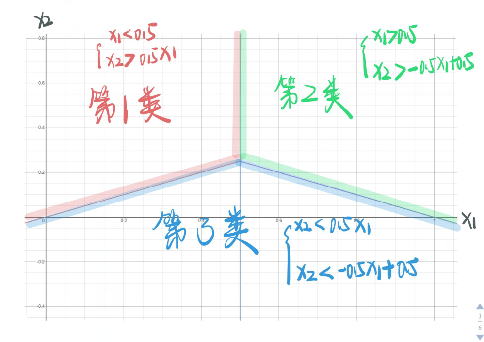
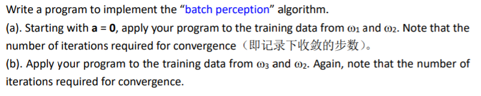
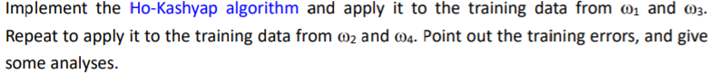

# Assignment-3

<center>黎郡 2020E8017782051</center>

## Question 1

现有四个来自于两个类别的二维空间中的样本，其中第一类的两个样本为$(1,4)^T$和$(2,3)^T$， 第二类的两个样本为$(4,1)^T$和$(3,2)^T$。这里，上标 T 表示向量转置。若采用规范化增广样 本表示形式，并假设初始的权向量 $a=(0,1,0)^T$，其中向量 a 的第三维对应于样本的齐次 坐标。同时，假定梯度更新步长$\eta _k$固定为 1。试利用批处理感知器算法求解线性判别函 数  $g(y)=a^T y $的权向量 a。（注：“规范化增广样本表示”是指对齐次坐标表示的样本进行 规范化处理）。

### Answer 1

感知准则函数如下：
$$
J_p(a)=\sum_{y\in Y}(-a^Ty),其中Y为错分样本集合。
$$
当y被错分的时候$a^Ty \leq 0$，则$-a^Ty\geq 0$。$\therefore J_p(a)$总是大于等于0。因此当可分情况下，当且仅当$Y=\empty$的时候$J_p(a)=0$,这时将不存在错分样本。因此分类问题可以转化为让目标函数$J_p(a):min_{a} J_p(a)$

对$J_p(a)$求偏导：
$$
\frac{\partial J_{p}(\mathbf{a})}{\partial \mathbf{a}}=-\sum_{\mathbf{y} \in Y} \mathbf{y}
$$
因此，根据梯度下降法，有如下更新准则 :
$$
\mathbf{a}_{k+1}=\mathbf{a}_{k}+\eta_{k} \sum_{\mathbf{y} \in Y_{k}} \mathbf{y}
$$
这里， $\mathbf{a}_{k+1}$ 是当前迭代的结果， $\mathbf{a}_{k}$ 是前一次迭代的 结果， $Y_{k}$ 是被 $\mathbf{a}_{k}$ 错分的样本集合 $, \quad \eta_{k}$ 为步长因子（更新动力因子）。

解：根据上述感知准则的原理，可以将样本按照规范化增广形式写成如下形式：
$$
\begin{aligned}
y_{1} &=(1,4,1)^{T} \\
y_{2} &=(2,3,1)^{T} \\
y_{3} &=(-4,-1,-1)^{T} \\
y_{4} &=(-3,-2,-1)^{T} \\
Y &=\left[y_{1}, y_{2}, y_{3}, y_{4}\right]
\end{aligned}
$$
根据已知$a_{0}=[0,1,0]^T$, 第一次迭代
$$
a_{0}^{T} Y=[0,1,0]\left[\begin{array}{rrrr}1 & 2 & -4 & -3 \\ 4 & 3 & -1 & -2 \\ 1 & 1 & -1 & -1\end{array}\right]=[4,3,-1,-2]
$$
后两个样本小于0发生分类错误，由题目可知$\eta _k$固定为 1，根据梯度下降法的更新准则：
$$
\mathbf{a}_{1}=\mathbf{a}_{0}+ \sum_{\mathbf{y} \in Y_{k}} \mathbf{y}\\a_{1}=a_{0}+y_{3}+y_{4}=[-7,-2,-2]^{T}
$$
第二次迭代
$$
a_{1}^{T} Y=[-7,-2,-2]\left[\begin{array}{rrrr}1 & 2 & -4 & -3 \\ 4 & 3 & -1 & -2 \\ 1 & 1 & -1 & -1\end{array}\right]=[-17,-22,32,27]
$$
前两个样本小于零，前两个样本判错，于是
$$
a_{2}=a_{1}+y_{1}+y_{2}=[-4,5,0]^T
$$
第三次迭代
$$
a_{2}^{T} Y=[16,7,11,2]
$$
全部样本判别正确，迭代结束，最终 $a=[-4,5,0]^T$

<div style="page-break-after:always"></div>

## Question 2

对于多类分类情形，考虑 one-vs-all 技巧，即构建 $c$ 个线性判别函数:
$$
g_{i}(\mathbf{x})=\mathbf{w}_{i}^{T} \mathbf{x}+w_{i 0}, \quad i=1,2, \ldots, c
$$
此时的决策规则为: 对 $j \neq i,$ 如果 $g_{i}(\mathbf{x})>g_{j}(\mathbf{x}), \mathbf{x}$ 则被分为 $\omega_{i}$ 类。现有三个二维空间内 的模式分类器，其判别函数为:
$$
\begin{array}{l}
g_{1}(\mathbf{x})=-x_{1}+x_{2} \\
g_{2}(\mathbf{x})=x_{1}+x_{2}-1 \\
g_{3}(\mathbf{x})=-x_{2}
\end{array}
$$
试画出决策面，指出为何此时不存在分类不确定性区域。

### Answer 2

解：对于one-vs-all问题，对于 $j \neq i,$ 如果 $g_{i}(\mathbf{x})>g_{j}(\mathbf{x}), \mathbf{x}$ 则被分为 $\omega_{i}$ 类

对于第一类样本,
$$
\left\{\begin{array}{ll}
g_1(x)>g_2(x) \\
g_1(x)>g_3(x)
\end{array}\right.\rightarrow
\left\{\begin{array}{ll}
-x_{1}+x_{2}> x_{1}+x_{2}-1 \\
-x_{1}+x_{2}> -x_{2}
\end{array}\right.
$$
解得
$$
\left\{\begin{array}{ll}
x_{1}< \frac{1}{2} \\
x_{2}> \frac{1}{2} x_{1}
\end{array}\right. \tag1
$$
对于第二类样本,
$$
\left\{\begin{array}{ll}
g_2(x)>g_1(x) \\
g_2(x)>g_3(x)
\end{array}\right.\rightarrow
\left\{\begin{array}{ll}
x_{1}+x_{2}-1> -x_{1}+x_{2} \\
x_{1}+x_{2}-1> -x_{2}
\end{array}\right.
$$
解得
$$
\left\{\begin{array}{ll}
x_{1}> \frac{1}{2} \\
2 x_{2}+x_{1}-1> 0
\end{array}\right. \tag2
$$
对于第三类样本,
$$
\left\{\begin{array}{ll}
g_3(x)>g_1(x) \\
g_3(x)>g_1(x)
\end{array}\right.\rightarrow
\left\{\begin{array}{ll}
-x_{2}> -x_{1}+x_{2} \\
-x_{2}> x_{1}+x_{2}-1
\end{array}\right.
$$
解得
$$
\left\{\begin{array}{ll}
x_{1}+2 x_{2}-1< 0 \\
x_{2}< \frac{1}{2} x_{1}
\end{array}\right. \tag3
$$
根据式 (1)$、(2) 、(3)$ 画出三类样本的决策区域如下图所示。根据如图所示结果可以发现，不存在无法决策的类别区域。



<div style="page-break-after:always"></div>

## Question 3

1. 

2. 

3. 

### Answer 3.1

根据Question 1 可知“batch perception”的计算方法，程序运行结果如下：

1. 对于sample1和sample2结果如下：

   > Iteration nums:1, $a^T$ = [-17.9  33.3   0. ]  
   > Iteration nums:2, $a^T$ = [-29.3  23.7   1. ]  
   > Iteration nums:3, $a^T$ = [-15.3  36.3   5. ]  
   > Iteration nums:4, $a^T$ = [-39.3  21.1   4. ]  
   > Iteration nums:5, $a^T$ = [-13.5  50.3  11. ]  
   > Iteration nums:6, $a^T$ = [-43.8  33.5   9. ]  
   > Iteration nums:7, $a^T$ = [-29.   47.4  12. ]  
   > Iteration nums:8, $a^T$ = [-40.4  37.8  13. ]  
   > Iteration nums:9, $a^T$ = [-40.6  35.2  16. ]  
   > Iteration nums:10, $a^T$ = [-25.8  49.1  19. ]  
   > Iteration nums:11, $a^T$ = [-41.4  37.6  19. ]  
   > Iteration nums:12, $a^T$ = [-37.3  40.4  20. ]  
   > Iteration nums:13, $a^T$ = [-37.5  37.8  23. ]  
   > Iteration nums:14, $a^T$ = [-36.9  36.5  25. ]  
   > Iteration nums:15, $a^T$ = [-32.8  39.3  26. ]  
   > Iteration nums:16, $a^T$ = [-36.3  35.2  27. ]  
   > Iteration nums:17, $a^T$ = [-32.2  38.   28. ]  
   > Iteration nums:18, $a^T$ = [-35.7  33.9  29. ]  
   > Iteration nums:19, $a^T$ = [-31.6  36.7  30. ]  
   > Iteration nums:20, $a^T$ = [-35.1  32.6  31. ]  
   > Iteration nums:21, $a^T$ = [-31.   35.4  32. ]  
   > Iteration nums:22, $a^T$ = [-34.5  31.3  33. ]  
   > Iteration nums:23, $a^T$ = [-30.4  34.1  34. ]  
   >
   > Process finished with exit code 0

2. 对于sample3和sample4结果如下：

   > Iteration nums:1, $a^T$ = [44.2 96.7  0. ]  
   > Iteration nums:2, $a^T$ = [36.1 95.4  2. ]  
   > Iteration nums:3, $a^T$ = [28.  94.1  4. ]  
   > Iteration nums:4, $a^T$ = [25.  91.2  5. ]  
   > Iteration nums:5, $a^T$ = [22.  88.3  6. ]  
   > Iteration nums:6, $a^T$ = [19.  85.4  7. ]  
   > Iteration nums:7, $a^T$ = [16.  82.5  8. ]  
   > Iteration nums:8, $a^T$ = [13.  79.6  9. ]  
   > Iteration nums:9, $a^T$ = [10.  76.7 10. ]  
   > Iteration nums:10, $a^T$ = [ 7.  73.8 11. ]  
   > Iteration nums:11, $a^T$ = [ 4.  70.9 12. ]  
   > Iteration nums:12, $a^T$ = [ 1. 68. 13.]  
   > Iteration nums:13, $a^T$ = [ 6.9 64.9 13. ]  
   > Iteration nums:14, $a^T$ = [ 3.9 62.  14. ]  
   > Iteration nums:15, $a^T$ = [ 0.9 59.1 15. ]  
   > Iteration nums:16, $a^T$ = [ 6.8 56.  15. ]  
   > Iteration nums:17, $a^T$ = [ 3.8 53.1 16. ]  
   > Iteration nums:18, $a^T$ = [ 0.8 50.2 17. ]  
   > Iteration nums:19, $a^T$ = [ 6.7 47.1 17. ]  
   > Iteration nums:20, $a^T$ = [ 3.7 44.2 18. ]  
   > Iteration nums:21, $a^T$ = [ 0.7 41.3 19. ]  
   > Iteration nums:22, $a^T$ = [ 6.6 38.2 19. ]  
   > Iteration nums:23, $a^T$ = [ 3.6 35.3 20. ]  
   > Iteration nums:24, $a^T$ = [ 0.6 32.4 21. ]  
   > Iteration nums:25, $a^T$ = [ 6.5 29.3 21. ]  
   > Iteration nums:26, $a^T$ = [ 3.5 26.4 22. ]  
   > Iteration nums:27, $a^T$ = [ 0.5 23.5 23. ]  
   > Iteration nums:28, $a^T$ = [ 6.4 20.4 23. ]  
   > Iteration nums:29, $a^T$ = [ 3.4 17.5 24. ]  
   > Iteration nums:30, $a^T$ = [ 0.4 14.6 25. ]  
   > Iteration nums:31, $a^T$ = [ 6.3 11.5 25. ]  
   > Iteration nums:32, $a^T$ = [ 3.3  8.6 26. ]  
   > Iteration nums:33, $a^T$ = [ 0.3  5.7 27. ]  
   > Iteration nums:34, $a^T$ = [24.4 12.7 24. ]  
   > Iteration nums:35, $a^T$ = [ 8.2 17.  28. ]  
   > Iteration nums:36, $a^T$ = [ 5.2 14.1 29. ]  
   > Iteration nums:37, $a^T$ = [ 2.2 11.2 30. ]  
   > Iteration nums:38, $a^T$ = [ 8.1  8.1 30. ]  
   > Iteration nums:39, $a^T$ = [ 5.1  5.2 31. ] 
   >
   > Process finished with exit code 0Answer 3.2

解： Ho-Kashyap算法：

根据MSE算法优化$||Ya-b||^2$可以知道，所得到的最优解并不需要位于可分超平面上。因此如果训练样本是线性可分的话，那么一定存在一个$a,b$使得$Ya=b>0$。由于我们并不知道这个$b$应该取多大，此时的$b$不再是任意给定的一个数。因此我们可以将MSE的准则函数更新为：
$$
J_s(a,b)=||Ya-b||^2
$$
注意：直接优化$J_s(a,b)=||Ya-b||^2$容易导致平凡解，因此需要给$b$加一个约束$b>0$.

对于$a$而言：
$$
\frac{\partial J_{s}(a,b)}{\partial {a}}=2Y^T(Ya-b)=0\\
则：Ya-b=0\rightarrow a=Y^{+}b,其中Y^{+}为Y的伪逆
$$
对于b而言：

$b$ 需要同时满足约束条件 $\mathbf{b}>\mathbf{0}$ 。梯度更新:
$$
\mathbf{b}_{k+1}=\mathbf{b}_{k}-\eta_{k} \frac{\partial J_{s}(\mathbf{a}, \mathbf{b})}{\partial \mathbf{b}}
$$
由于 $\mathbf{b}_{k}$ 总是大于零，要使b $_{k+1}$ 也大于零，可以要求 $\partial J_{s}(\mathbf{a}, \mathbf{b}) / \partial \mathbf{b}$ 为负。

$\mathbf{b}$ 的梯度下降可以改写成下式：
$$
\mathbf{b}_{1}>\mathbf{0}, \quad \mathbf{b}_{k+1}=\mathbf{b}_{k}-\eta_{k} \frac{1}{2}\left(\frac{\partial J_{s}(\mathbf{a}, \mathbf{b})}{\partial \mathbf{b}}-\left|\frac{\partial J_{s}(\mathbf{a}, \mathbf{b})}{\partial \mathbf{b}}\right|\right)\\
此时：\frac{1}{2}\left(\frac{\partial J_{s}(\mathbf{a}, \mathbf{b})}{\partial \mathbf{b}}-\left|\frac{\partial J_{s}(\mathbf{a}, \mathbf{b})}{\partial \mathbf{b}}\right|\right)一定小于等于0
$$
更新$ a 、 b$ :
$$
\begin{array}{c}
&\mathbf{a}_{k}=\mathbf{Y}^{+} \mathbf{b}_{k} \\
&\mathbf{b}_{1}>\mathbf{0}, \quad \mathbf{b}_{k+1}=\mathbf{b}_{k}+2 \eta_{k} \mathbf{e}_{k}^{+}\\

&其中：\mathbf{e}_{k}^{+}=\frac{1}{2}\left(\left(\mathbf{Y} \mathbf{a}_{k}-\mathbf{b}_{k}\right)+\left|\mathbf{Y} \mathbf{a}_{k}-\mathbf{b}_{k}\right|\right), \quad \because \frac{\partial J_{s}(\mathbf{a}, \mathbf{b})}{\partial \mathbf{b}}=-2(\mathbf{Y} \mathbf{a}-\mathbf{b})
\end{array}\\
$$
由于初始$b_1>0$,且更新因子$\eta>0$，因此$b_k$总是大于0

对于更新因子$\eta \in (0,1]$，如果问题线性可分，则总能找到元素全为正的b。

如果$e_k=Ya_k-b_k$全为0， 此时$b_k$将不再更新，因此获得一个解。如果$e_k$有一部分元素小于0，则可以证明该问题不是线性可分的。

根据上述算法，编写程序：令学习率$\eta_k=1, a=[0, 0 ,0],b$为用0-1之间的随机数随机初始化的一个$1\times 20$的矩阵。

```python
iter_num = 0
while min(e)<0:
    iter_num += 1
    e_ = 0.5*(e+abs(e))
    b = b+2*learning_rate*e_
    a = np.dot(b, np.linalg.pinv(Y).transpose())
    e = np.dot(a, Y.transpose()) - b
    print("iteration nums:" + str(iter_num) + ", a = " + str(a) + ", b = " + str(b))
    if iter_num > 50000:
        break
    if abs(e).sum() < 0.001:
        break
print(e)
```

实验结果如下：

观察对$w_1,w_3$数据的训练过程我们可以发现，再迭代50001次后，误差向量$e$仍然存在少数的负数分量，但都接近于0。观察向量b的历史数据可以发现，b几乎不再改变，说明b已经收敛，所以可以认为在50001次时已经有了近似解。

> iteration nums:50001
>
> a = [ 0.27521491 -0.1920547   0.08026759], 
>
> b = [0.06846006 0.64830714 0.21923511 0.66859362 0.86395917 0.21235355
>  0.2069912  0.85353701 0.34300515 0.38538695 0.78344853 1.45300083
>  0.83390472 0.94593833 1.44311239 0.98811418 2.04620224 1.70109952
>  1.63061597 0.97696527]
>
> e = [-1.71931141e-01 -6.01665086e-02 -3.14795436e-01 -5.56443888e-01
>  -1.93063599e-01 -2.39193223e-01 -9.72244268e-02 -7.56041633e-01
>  -1.15813075e-01 -1.66533454e-16 -5.95030016e-01  0.00000000e+00
>  -1.30898069e+00 -1.11022302e-16  0.00000000e+00 -1.11022302e-16
>  -4.44089210e-16  0.00000000e+00 -2.22044605e-16 -6.00662228e-01]

观察对$w_2,w_4$数据的训练过程我们可以发现，再迭代517次后，误差向量$e$已近接近于0了，则在数据2，4中是无法线性可分的。

> iteration nums:517
>
> a = [0.21787046 0.19283731 1.30649534], 
>
> b = [3.66326455 0.17274297 2.28691243 2.98758616 2.58791334 0.9944346
>  1.05803547 0.67486397 3.85010582 1.77550128 0.74936133 0.59409007
>  1.09340795 1.16247608 0.9245813  0.57654216 1.14022813 1.82312309
>  2.11090684 1.65133841]
> e=[ 2.77884872e-05 -4.66709563e-04  4.66903405e-09  3.28036078e-05
>   2.88394740e-05  8.30766200e-09 -2.44268164e-07 -5.14583529e-08
>  -5.31157987e-07  2.08852964e-05 -2.82353319e-04 -1.05744726e-04
>  -6.22161034e-08  6.91693928e-06  4.70802333e-06  9.73926020e-07
>  -3.95914337e-08  1.33793114e-05  5.72644021e-09  5.00932002e-06]

### Answer 3.3

对于MSE多分类而言，目标函数为：
$$
\begin{array}{c}
\min _{\mathbf{W}, \mathbf{b}} \sum_{i=1}^{n}\left\|\mathbf{W}^{T} \mathbf{x}+\mathbf{b}-\mathbf{y}_{i}\right\|_{2}^{2} \\
\hat{\mathbf{W}}=\left(\begin{array}{c}
\mathbf{W} \\
\mathbf{b}^{T}
\end{array}\right) \in R^{(d+1) \times c}, \quad \hat{\mathbf{x}}=\left(\begin{array}{c}
\mathbf{x} \\
1
\end{array}\right) \in R^{d+1}, \quad \hat{\mathbf{X}}=\left(\hat{\mathbf{x}}_{1}, \hat{\mathbf{x}}_{2}, \cdots, \hat{\mathbf{x}}_{n}\right) \in R^{(d+1) \times n} \\
\sum_{i=1}^{n}\left\|\mathbf{W}^{T} \mathbf{x}+\mathbf{b}-\mathbf{y}_{i}\right\|_{2}^{2}=\left\|\hat{\mathbf{W}}^{T} \hat{\mathbf{X}}-\mathbf{Y}\right\|_{F}^{2} \quad\left(\|.\|_{F} \text { 为Frobenius范数 }\right) \\
\min _{\hat{\mathbf{w}}}\left\|\hat{\mathbf{W}}^{T} \hat{\mathbf{X}}-\mathbf{Y}\right\|_{F}^{2} \\
\hat{\mathbf{W}}=\left(\hat{\mathbf{X}} \hat{\mathbf{X}}^{T}\right)^{-1} \hat{\mathbf{X}} \mathbf{Y}^{T} \in R^{(d+1) \times c} \quad \hat{\mathbf{W}}=\left(\hat{\mathbf{X}} \hat{\mathbf{X}}^{T}+\lambda \mathbf{I}\right)^{-1} \hat{\mathbf{X}} \mathbf{Y}^{T} \in R^{(d+1) \times c}
\end{array}
$$
决策条件为：
$$
\text{if  }j=arg_{max}(W^Tx+b), then\text{  } x\in w_j
$$
所以根据上述式子，求出$\hat W$即可求解。

使用前每个类别的前8个类别构建样本，求解处$\hat W$结果如下：

> $\hat w =$ [[ 0.02049668  0.01626151  0.26747287]
>  [ 0.06810971 -0.03603827  0.27372075]
>  [-0.04087307  0.05969134  0.25027714]
>  [-0.04773332 -0.03991458  0.20852924]]

接着将每个类别的后两个数据做成测试数据，带入结果为：

> test_result: [1 1 2 2 3 3 4 4]

所以可以发现该分类器准确预测结果，正确率为百分之百。