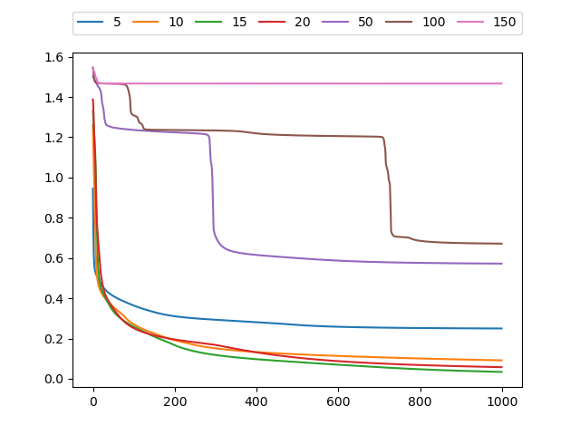
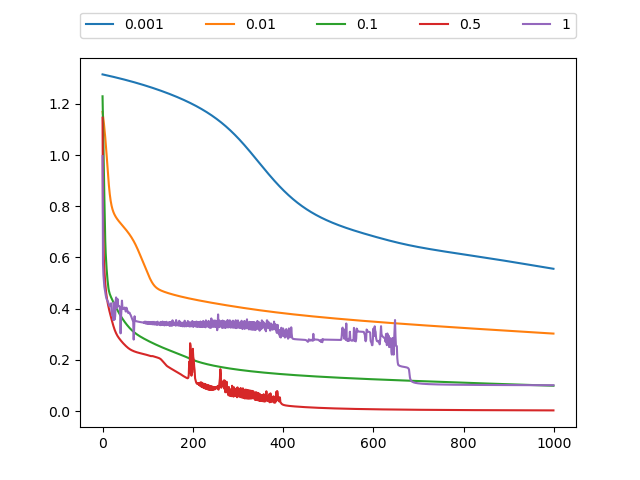
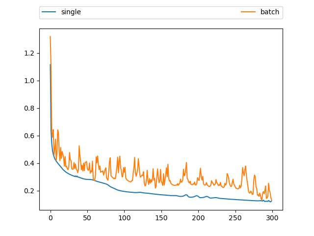

# Assignment-4

 黎郡 2020E8017782051

## Question 1

1． Consider a three-layer network for classification with $n_H$ nodes in hidden layer, and c nodes in output layer. The patterns (also say samples ) are in d dimensional space. The activation function (or transfer function) for the nodes in the hidden layer is the sigmoid function. Differently, the nodes in the output layer will employ the following softmax operation as their activation function:
$$
z_j=\frac{e^{net_j}}{\sum^c_{m=1}e^{net_m}}, j=1,2,...,c
$$
where $net_j$ stands for the weighted sum at the j-th node in the output layer. Please derive the learning rule under the back propagation framework if the criterion function for each sample is the sum of the squared errors, that is （即分析每一层权重的更新方法）:
$$
J(\mathbf{w}) =\frac{1}{2} \sum_{j}\left(t_{j}^{k}-z_{j}^{k}\right)^{2}
$$
Where $t_j$ is the known target value for the sample at the j-th node in the output layer. 注意：本题只需要推导出单个样本对权重更新的贡献即可（因为多个样本只是简单 地相加）

2． 请对反向传播算法的训练步骤进行总结；结合三层网络给出不超过三个有关权重更新的 公式，并用文字描述所述公式的含义；指出哪些因素会对网络的性能产生影响。

### Answer 1

题意分析：

- 一个三层的卷积神经网络

- $n_H$个隐藏节点，c个输出节点

- 样本是在d维空间中的

- 隐藏层中的激活函数是sigmod函数

- 输出层的激活函数是softmax函数
  $$
  z_j=\frac{e^{net_j}}{\sum^c_{m=1}e^{net_m}}, j=1,2,...,c
  $$

- loss为最下均方误差，分析每一层权重的更新方法。

|    $z_1,z_2,...,z_c$    |      | 误差函数                             | $E=J(w)=\frac{1}{2}\sum^c_{j=1}(t_j-z_j)^2$                  |
| :---------------------: | ---- | ------------------------------------ | ------------------------------------------------------------ |
|       $\uparrow$        |      |                                      |                                                              |
| output $softmax(\cdot)$ |      | 经过激励，输出层j节点的输出          | $z_j^k=f(net_j^k)=f(\sum_h w_{hj}f(\sum_i w_{ih}x_i^k))$     |
|   $\uparrow$ $w_{hj}$   |      | 输出层j节点的输入加权和              | $net_j^k=\sum_h w_{hj}y_h^k=\sum_h w_{hj}f(\sum_i w_{ih}x_i^k)$ |
| hidden $sigmod(\cdot)$  |      | 经过激励，隐含层h节点的输出          | $y_h^k=f(net_h^k)=f(\sum_i w_{ih}x_i^k)$                     |
|   $\uparrow$ $w_{ih}$   |      | 对第k个样本，隐含层h节点的输入加权和 | $net_h^k=\sum_i w_{ih}x_i^k$                                 |
|   $b,x_1,x_2,...,x_d$   |      |                                      |                                                              |
|                         |      |                                      |                                                              |

(a) 根据上表可知，对于第 $k$ 个样本

- 隐含层 $h$ 结点的输入加权和为 $n e t_{h}^{k}=\sum_{i} w_{i h} x_{i}^{k}$ 

- 经过激励，隐含层h结点的输出为 $y_{h}^{k}=f\left(n e t_{h}^{k}\right)=f\left(\sum_{i} w_{i h} x_{i}^{k}\right)$ 

- 输出层j结点的输入加权和为 $n e t_{j}^{k}=\sum_{h} w_{h j} y_{h}^{k}=\sum_{h} w_{h j} f\left(\sum_{j} w_{i h} x_{i}^{k}\right)$

- 因为隐藏层中的激活函数是sigmod函数，所以经过激励，输出层 $j$ 结点的输出为
  $$
  z_{j}^{k}=f(net_j^k)=\frac{e^{n e t_{j}^{k}}}{\sum_{m=1}^{c} e^{n e t_{m}^{k}}}
  $$
  
- 对于单个样本带入误差函数
  $$
  \begin{aligned}
  J(\mathbf{w}) &=\frac{1}{2} \sum_{j}\left(t_{j}^{k}-z_{j}^{k}\right)^{2} \\
  &=\frac{1}{2} \sum_{j}\left(t_{j}^{k}-f(net_j^k)\right)^{2} \\
  &=\frac{1}{2} \sum_{j}\left\{t_{j}^{k}-f\left(\sum_{h} w_{h j} y_{h}^{k}\right)\right\}^{2} \\
  &=\frac{1}{2} \sum_{j}\left\{t_{j}^{k}-f\left(\sum_{h} w_{h j} f\left(n e t_{h}^{k}\right)\right)\right\}^{2} \\
  &=\frac{1}{2} \sum_{j}\left\{t_{j}^{k}-f\left(\sum_{h} w_{h j} f\left(\sum_{i} w_{i h} x_{i}^{k}\right)\right)\right\}
  \end{aligned}
  $$
  

**第一步：隐含层到输出层的连接权重调节量为**
$$
\frac{\partial z_{k}}{\partial n e t_{j}}=\left\{\begin{array}{l}\frac{e^{n e t_{j}} \cdot \sum_{m=1}^{c} e^{n e t_{m}}-\left(e^{n e t_{j}}\right)^{2}}{\left(\sum_{m=1}^{c} e^{n e t_{m}}\right)^{2}}=\frac{e^{n e t_{j}}}{\sum_{m=1}^{c} e^{n e t_{m}}}\left(1-\frac{e^{n e t_{j}}}{\sum_{m=1}^{c} e^{n e t_{m}}}\right)=z_{k}\left(1-z_{k}\right), k=j \\ \frac{0 \cdot \sum_{m=1}^{c} e^{n e t_{m}}-e^{n e t_{k}} e^{n e t_{j}}}{\left(\sum_{m=1}^{c} e^{n e t_{m}}\right)^{2}}=-\frac{e^{n e t_{k}} \cdot e^{n e t_{j}}}{\left(\sum_{m=1}^{c} e^{n e t_{m}}\right)^{2}}=-z_{k} \cdot z_{j}, \quad k \neq j\end{array}\right.
$$

$$
\begin{aligned} \Delta w_{h j} &=-\eta \frac{\partial J}{\partial w_{h j}} \\ &=-\eta \frac{\partial J}{\partial n e t_{j}} \frac{\partial n e t_{j}}{\partial w_{h j}} \\ &=-\eta\left(\sum_{k=1}^{c} \frac{\partial J}{\partial z_{k}} \frac{\partial z_{k}}{\partial n e t_{j}}\right) \frac{\partial n e t_{j}}{\partial w_{h j}}t \\ 
&=\eta\left(\left(t_{j}-z_{j}\right) z_{j}\left(1-z_{j}\right)-\sum_{k=1, k \neq j}^{c}\left(t_{j}^k-z_{j}^k\right) z_{k} z_j\right) y_{h}^{k} \end{aligned}
$$

**第二步：输入层到隐含层的连接**
$$
\begin{aligned}
\Delta w_{i h} &=-\eta \frac{\partial J}{\partial w_{i h}}=-\eta \sum_{j=1}^{c}\left(\sum_{k=1}^{c} \frac{\partial J}{\partial z_{k}} \frac{\partial z_{k}}{\partial n e t_{j}}\right) \frac{\partial n e t_{j}}{\partial y_{h}} \frac{\partial y_{h}}{\partial n e t_{h}} \frac{\partial n e t_{h}}{\partial w_{i h}} \\
&=-\eta \sum_{j=1}^{c}\left(\frac{\partial J}{\partial z_{k}} \frac{\partial z_{k}}{\partial n e t_{j}}+\sum_{k=1, k \neq j}^{c} \frac{\partial J}{\partial z_{k}} \frac{\partial z_{k}}{\partial n e t_{j}}\right) \frac{\partial n e t_{j}}{\partial y_{h}} \frac{\partial y_{h}}{\partial n e t_{h}} \frac{\partial n e t_{h}}{\partial w_{i h}} \\
&=\eta \sum_{j=1}^{c}\left[\left(t_{j}-z_{j}\right) \cdot z_{j}\left(1-z_{j}\right)+\sum_{k=1, k \neq j}^{c}\left(t_{j}-z_{k}\right) \cdot z_{k} z_{j}\right] w_{h j} y_{h}\left(1-y_{h}\right) x_{i}
\end{aligned}
$$
因此更新时单个样本对 $w_{i h}$ 的贡献为:
$$
\Delta w_{i h}=\eta \sum_{j=1}^{c}\left[\left(t_{j}-z_{j}\right) \cdot z_{j}\left(1-z_{j}\right)+\sum_{k=1, k \neq j}^{c}\left(t_{j}-z_{k}\right) \cdot z_{k} z_{j}\right] w_{h j} y_{h}\left(1-y_{h}\right) x_{i}
$$

(b) 请对反向传播算法的训练步骤进行总结；结合三层网络给出不超过三个有关权重更新的公式，并用文字描述所述公式的含义；指出哪些因素会对网络的性能产生影响。

1. 反向传播算法的训练步骤：

   > - 初始化参数 $w, \quad \eta, \quad \theta, \quad k=0$
   > - 前向传播，根据根据输入，计算 h 层的输出值
   >
   > $$
   > net_h^k=\sum_i w_{ih}x_i^k, \quad y_h^k=f(net_h^k)=f(\sum_i w_{ih}x_i^k)
   > $$
   > - $B P$ ，利用梯度下降法从输出层开始更新每一层的权重，算法对任意层的加权修正量的一般形式:
   >   $$
   >   \Delta w_{i n \rightarrow o}=\eta \sum_{\text {all samples}} \delta_{o} y_{\text {in}}
   >   $$
   >   单个训练样本的贡献:
   >   $$
   >   \Delta w_{i n \rightarrow o}=\eta \cdot \delta_{o} \cdot y_{i n}=\eta \cdot\left(\sum_{h} w_{o \rightarrow h}\left[\delta_{o}\right]_{h}\right) \cdot y_{i n}
   >   $$
   >   下标in和o分别指“待更新权重”所连边的起始结点和指向结点, $y_{i n}$ 代表起始结点的实际输出， $\delta_{o}$ 表示指向结点的误差（由后一层收集 得到）。
   >
   > - 当找到极值点的时候，即损失不再变小的时候停止训练，否则继续用BP算法进行误差修正，

2. 权重更新公式

   > - 隐含层到输出层的连接权重条件量为:
   >
   > $$
   > \Delta w_{h j}=\eta \sum_{k} \delta^{k} y_{h}^{k}
   > $$
   > ​	其中 $\delta_{j}^{k}$ 是边 $w_{h j}$ 指向节点的误差局部梯度即 $\frac{\partial E}{\partial n e t_{j}^{k}} $
   >
   > - 输入层到隐含层连接权重更新量为:
   >
   > $$
   > \Delta w_{i h}=\eta \sum_{k} \delta_{h}^{k} x_{i}^{k}
   > $$
   > ​	其中 $\delta_{h}^{k}$ 是边 $w_{i h}$ 指向节点的误差局部梯度即 $\frac{\partial E}{\partial n e t_{j}^{k}}=f^{\prime}\left(n e t_{h}^{k}\right) \sum_{j} w_{h j} \delta_{j}^{k} \circ$

3. 网络性能影响：

   > 在训练网络的过程中，网络会受到初始的参数值，网络的层数，隐含节点的数目等影响。网络训练的超参数例如学习率，以及激活函数的选择都会影响网络前向后向传播参数的计算更新。当网络层数过多，隐层节点过多时，网络的模型参数就会过于复杂，训练难以收敛。当网络结果过于简单的时候，又难以适应复杂数据。对于学习率而言，学习率会影响网络收敛的速度，学习率越大，网络收敛的越快，但是容易过大，且如果学习率较大，很有可能无法收敛，一直震荡。学习率过下，误差虽然下降平缓，但是收敛速度会非常的慢。

## Question 2

1. 请编写两个通用的三层前向神经网络反向传播算法程序，一个采用批量方式更新权 重，另一个采用单样本方式更新权重。其中，隐含层结点的激励函数采用双曲正切 函数，输出层的激励函数采用 sigmoid 函数。目标函数采用平方误差准则函数。 
2. 请利用上面的数据验证你写的程序，分析如下几点： (a) 隐含层不同结点数目对训练精度的影响； (b) 观察不同的梯度更新步长对训练的影响，并给出一些描述或解释； (c) 在网络结构固定的情况下，绘制出目标函数随着迭代步数增加的变化曲线.。

### Answer 2

代码主要包含三个脚本文件Dataset.py、network.py、和main.py

* Dataset.py主要是根据输入数据生成训练数据
* network.py包含了网络的主要结构，前向传播和反向传播皆在该文件中实现。
* main.py为三个实验的主题部分

实验结果直接运行main.py即可

#### 实验结果与分析：

**(a) 隐含层不同结点数目对训练精度的影响；**

> 实验分别对隐含节点为hids = [5, 10, 15, 20, 50, 100, 150]进行了实验，学习率eta=0.1，迭代次数epoch_num=1000
>
> 
>
> 观察实验结果可以发现：
>
> 在隐含层节点数目大小合理的情况下，隐含层节点数目越多，理论上最后的误差会越小。然而隐含层节点不能无限增加，观察图标我们可以发现，当隐含层节点为50以上的时候，节点的增加并没有让模型的性能变得更好。模型过于复杂使得计算难度增加，模型难以收缩。

 **(b) 观察不同的梯度更新步长对训练的影响，并给出一些描述或解释；**

> 实验时, 保持网络结构不变, 隐含层包含10个结点, 改变梯度更新步长etas 分别取 [1e-3, 1e-2, 1e-1, 5e-1, 1], 不同更新步长下的网络输出误差随迭代次数增加的变化曲线如下图所示.
>
> 
>
> 可以看到, 梯度更新步长的增加可以加快误差的下降, 在迭代次数相同的情况下, 观察学习率分别为0.001，0.01和0.1的误差下降曲线可以发现，在步长大小处理合理范围的时候梯度更新步长一定程度上的增大, 可以提升训练精度。由于更新步长的增大, 权重矩阵每次更新向最优矩阵迈出的步伐越大, 会以更快的速度接近最优矩阵。
>
> 但同时也可以发现, 当梯度更新步长过大时,如图中学习率为0.5和1的两条曲线, 观察这两条曲线我们可以发现网络训练变得不稳定, 会出现震荡的现象，这是因为过大的更新步长可能导致权重矩阵更新时越过最优权重, 出现矫枉过正的情况, 进而上下往复调整。

 **(c) 在网络结构固定的情况下，绘制出目标函数随着迭代步数增加的变化曲线；**

> 实验时, 保持网络结构不变, 隐含层包含10个结点, 改变梯度更新步长$\eta$依次为0.6, 迭代次数为300。
>
> 
>
> 观察实验结果可以发现，采用单个样本进行更新的时候，训练过程比较平滑稳定。采用批处理进行梯度下降的时候下降过程明显更为震荡不稳定。可以看到, 相同参数下, 批量更新方式下的曲线是震荡下降的. 若希望得到平稳的训练过程, 则需要适量减小更新步长.