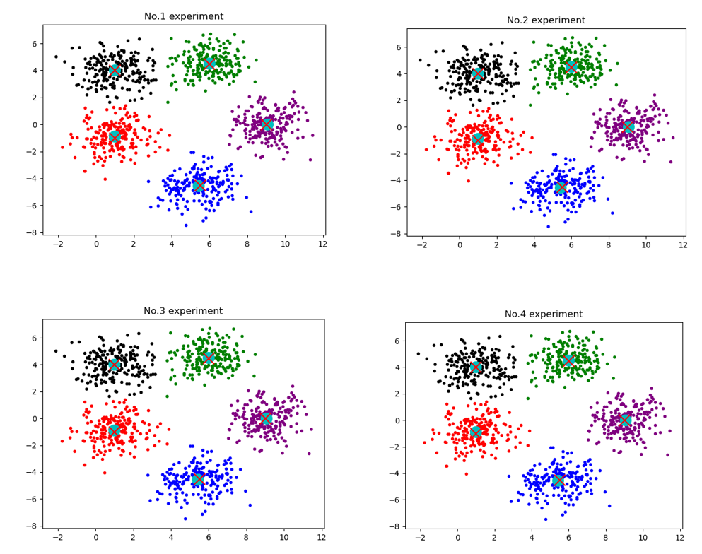
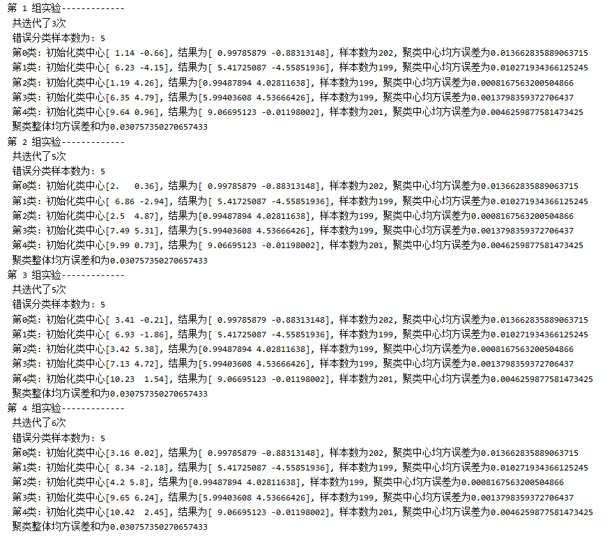

# Assignment-5

<center> 黎郡 2020E8017782051
</center>
## Part 1

1. #####  请简述 adaboost 算法A的设计思想和主要计算步骤

   > 1. ###### Adaboost算法的设计思想：
   >
   >    从弱学习算法出发，反复学习，得到一系列弱分类器；然后组合这些弱分类器，构成一个强分类器。 具体而言就是：
   >
   >    a. 提高那些被前一轮弱分类器分错的样本的权重，降低已经被正确分类的样本的权重错分的样本将在下一轮弱分类器中得到更多关注。
   >
   >    b. 在弱分类器组合的时候，采用加权（多数）表决的方法。具体的，加大分类错误率较小的弱分类器的权重，使其在表决中起更大的作用。
   >
   > 2. ###### 算法的主要计算步骤
   >
   >    - 输入训练数据
   >
   >    - 输入弱学习算法
   >
   >      1. 初始化训练数据的权值分布
   >
   >      2. 迭代m次
   >
   >         - a. 使用具有权值分布 $D_{m}$ 的训练数据，学习基本分类器
   >
   >         $$
   >         G_{m}(\mathbf{x}): \boldsymbol{X} \rightarrow\{-1,+1\}
   >         $$
   >         - b. 计算 $G_{m}(\mathbf{x})$ 在训练数据集上的分类错误率(加权):
   >
   >         $$
   >         e_{m}=P\left(G_{m}\left(\mathbf{x}_{i}\right) \neq y_{i}\right)=\sum_{i=1}^{n} w_{m i} {I\left(G_{m}\left(\mathbf{x}_{i}\right) \neq y_{i}\right)}
   >         $$
   >         - c. 计算 $G_{m}(\mathbf{x})$ 的贡献系数: 
   >           $$
   >           \alpha_{m}=\frac{1}{2} \ln \frac{1-e_{m}}{e_{m}}
   >           $$
   >           $\alpha_{m}$ 表示 $G_{m}(\mathbf{x})$ 在最终分类器中的重要性。当 $e_{m} \leq 0.5$ 时, $\alpha_{m} \geq 0 $同时, $\alpha_{m}$ 将随着 $e_{m}$ 的减小而增大。
   >           所以，分类误差率越小的基本分类器在最终分类器中的作用越大。
   >
   >         - d. 更新训练数据集的权重分布:
   >
   >         $$
   >         _{m+1}=\left\{w_{m+1,1}, w_{m+1,2}, \ldots, w_{m+1, n}\right\}
   >         $$
   >         ​	具体计算如下:
   >         $$
   >         \begin{aligned}
   >         w_{m+1, j} &=\frac{w_{m i}}{Z_{m}} \times\left\{\begin{array}{l}
   >         \exp \left(-\alpha_{m}\right), &\text { if } G_{m}\left(\mathbf{x}_{i}\right)=y_{i} \\
   >         \exp \left(\alpha_{m}\right), & \text { if } G_{m}\left(\mathbf{x}_{i}\right) \neq y_{i}
   >         \end{array}\right\} \text { 若正确分类, 减少权重；否则会增加权重} \\
   >         &=\frac{w_{m i}}{Z_{m}} \times \exp \left(-\alpha_{m} y_{i} G_{m}\left(\mathbf{x}_{i}\right)\right)
   >         \end{aligned}
   >         $$
   >         ​	其中， $Z_{m}$ 是规范化因子，它使 $D_{m+1}$ 成为一个概率分布:
   >         $$
   >         Z_{m}=\sum_{i=1}^{n} w_{m i} \exp \left(-\alpha_{m} y_{i} G_{m}\left(\mathbf{x}_{i}\right)\right)
   >         $$
   >
   >    - 构建基本分类器的线性组合:
   >      $$
   >      f(x)=\sum^{M}_{m=1}a_mG_m(x)
   >      $$
   >      若对于二分类问题，得到的最终的分类器为：
   >      $$
   >      G(x)=sign(f(x))=sign(\sum^{M}_{m=1}a_mG_m(x))
   >      $$

   <div STYLE="page-break-after: always;"></div>

2. ##### 请从混合高斯密度函数估计的角度，简述K-Means聚类算法的原理(请主要用文字描述， 条理清晰)；请给出 K-Means 聚类算法的计算步骤；请说明哪些因素会影响 K-Means 算法的聚类性能。

> 1. ###### 请从混合高斯密度函数估计的角度，简述K-Means聚类算法的原理(请主要用文字描述， 条理清晰)；
>
>    混合高斯密度估计是指对于一个由 $k$ 个高斯成分组成的分布，利用给定数据估计高斯成分的参数，并给出样本所属于的高斯成分。通过得到样本的隶属关系，可以得到聚类结果。K-均值聚类是混合高斯密度估计的一种特例，其在一般的混合高斯密度估计中引入以下先验假设:
>
>    - 各个类别的先验概率 $P\left(\omega_{i}\right)$ 相等
>    - 每个高斯分布的协方差矩阵均已知，且为单位矩阵
>    - 每个样本点都以概率 1 隶属于后验概率最大的类
>
> 2. ###### 请给出 K-Means 聚类算法的计算步骤
>
>    在上一条的前提下，后验概率最大等价于样本到类的对应类中心的欧氏距离最小
>    $$
>    P\left(\omega_{i} \mid x_{j}, \hat{\mu}_{i}\right)=\left\{\begin{array}{ll}
>    1 & \hat{\mu}_{i} \text { is the nearest center to } x_{j} \\
>    0 & \text { otherwise }
>    \end{array}\right.
>    $$
>    此时利用极大似然估计 $\max _{\mu}\{P(D \mid \mu)\},$ 可以得到下式：
>    $$
>    \hat{\mu}_{i}=\frac{\sum_{k=1}^{n} P\left(\omega_{i} \mid \mathbf{x}_{k}, \mu\right) \mathbf{x}_{k}}{\sum_{k=1}^{n} P\left(\omega_{i} \mid \mathbf{x}_{k}, \mu\right)}=\frac{1}{n_{i}} \sum_{\mathbf{x}_{k} \in \omega_{i}} \mathbf{x}_{k}, i=1,2, \ldots n
>    $$
>    由于此时 $P\left(\omega_{i} \mid \mathbf{x}_{k}, \mu\right)$ 同时也由 $\mu$ 决定，这时整个等式是无法求解的。所以可以将问题转为一个迭代问题。首先初始化 $\hat{\mu},$ 然后利用 $\hat{\mu}$ 遍历每一个样本点，对于距离最近的类别 $i$ 设定 $P\left(\omega_{i} \mid \mathbf{x}_{k}, \hat{\mu}\right)=1,$ 再用得到 的 $P\left(\omega_{i} \mid \mathbf{x}_{k}, \hat{\mu}\right)$ 计算 $\hat{\mu}_{i}$ ，循环迭代多次，直到 $\hat{\mu}$ 不再改变。
>
> ```python
> function K-MEANS(W,k):
>     初始化k个据类中心u1,u2,..,uk,初始化上次的据类中心u_pre1, u_pre2, ..,u_prek
>     while u1!=u_pre1 and u1!=u_pre2,...and uk!=u_prek:
>         赋值u1,u2,..,uk = u_pre1, u_pre2, ..,u_prek
>         计算每个样本点到每个聚类中心的距离dist[n,k]，得到每个类对应的样本A1,A2,...,Ak
>         更新每个样本的中心 u_i = 1/n(sum(x_k))
>     return k个簇中包含的样本A1,A2,...,Ak
> ```
>
> 3. ###### 请说明哪些因素会影响 K-Means 算法的聚类性能
>
>    - 类别数量k。不同的聚类中心个数k的设定不同会产生不同的聚类结果。
>    - 初始聚类中心$\{u_1,u_2,u_k\}$。K-Means对初始类中心十分敏感，聚类中心选择不恰当，可能会收敛到错误的聚类结果。
>    - 适合于发现非凸曲面簇以及大小相差很大的簇
>    - 对噪声、孤立点数据以及野点十分敏感。
>
>    

3. #####  请简述谱聚类算法的原理，给出一种谱聚类算法（经典算法、Shi 算法和 Ng 算法之一） 的计算步骤；请指出哪些因素会影响聚类的性能。

> 1. ###### 谱聚类算法的原理：
>
>    谱聚类算法建立在图论中的谱图理论基础之上,其本质是将聚类问题转化为一个图上的关于顶点划分的最优问题。从图切割的角度,聚类就是要找到一种合理的分割图的方法,分割后能形成若干个子图。连接不同子图的边的权重尽可能小,子图内部边权重尽可能大。
>
> 2. ###### 谱聚类经典算法步骤：
>
>    对于 $n$ 个样本，将其分为 $k$ 个类，步骤如下:
>
>    - 利用点对之间的相似性，构建亲和度矩阵 $W_{n \times n},$ 并计算度矩阵 $D_{m\times n}$ 
>    - 构造拉普拉斯矩阵$L_{n\times n}=D_{n\times n}-W_{n\times n}$
>    - 计算$L_{n\times n}$的特征值，将特征值从小到大排序，提取前 k 个特征值对应的特征向量$\{\mu_{1}, \mu_{2},...,\mu_{k}\} $
>    - 将以上的 $k$ 个长度为 $n$ 的列向量组成矩阵 $U=\left\{\mu_{1}, \mu_{2}, \ldots, \mu_{k}\right\} \in R^{n \times k}$ 
>    - 令 $y_{i} \in R^{k}$ 为 $U$ 的第 $i$ 行元素组成的向量, $i=1,2, \ldots, n$
>    - 使用 K-means 算法将新样本点 $Y=\left\{y_{1}, y_{2}, \ldots, y_{n}\right\}$ 聚成 $k$ 个类别 $A_{1}, A_{2}, \ldots, A_{k}$ 
>    - 输出聚类结果 $A_{1}, A_{2}, \ldots, A_{k}$ 
>
> 3. ###### 影响谱聚类算法性能的因素：
>
>    - 如果最终聚类的维度非常高，则可能由于降维幅度不够，谱聚类的运行速度和最后的聚类效果均不好
>    - 聚类依赖于相似矩阵，不同的相似矩阵构造方式可能会得到不同的聚类结果。
>    - 聚类中心个数 k 和初始化样本的中心点。


<div STYLE="page-break-after: always;"></div>

## Part 2

### question 1

请完成如下工作：

- 编写一个程序，实现经典的 K-均值聚类算法；
- 令聚类个数等于 5，采用不同的初始值，报告聚类精度、以及最后获得的聚类中心， 并计算所获得的聚类中心与对应的真实分布的均值之间的误差。

#### Answer 1

#### 实验结果分析：

运行kmeans.py即可得到实验结果

通过四种情况的讨论可以看出，当初始中心符合样本的理论分布中心的时候kmeans算法能快速迭代到理论中心，且分类效果非常的好。

> 图中红色×为理论中心，绿色



#### 实验代码：

###### 数据生成代码

```python
import numpy as np
import matplotlib.pyplot as plt


def generate_sample():
    # 设置Sigma
    sigma = np.array([[1.0, 0.0], [0.0, 1.0]])
    # 设置mu
    mu_1 = np.array([1.0, -1.0])
    mu_2 = np.array([5.5, -4.5])
    mu_3 = np.array([1.0, 4.0])
    mu_4 = np.array([6.0, 4.5])
    mu_5 = np.array([9.0, 0.0])
    # 随机生成数据
    x_1 = np.random.multivariate_normal(mu_1, sigma, 200)
    x_2 = np.random.multivariate_normal(mu_2, sigma, 200)
    x_3 = np.random.multivariate_normal(mu_3, sigma, 200)
    x_4 = np.random.multivariate_normal(mu_4, sigma, 200)
    x_5 = np.random.multivariate_normal(mu_5, sigma, 200)

    x = np.concatenate([x_1, x_2], axis=0)
    x = np.concatenate([x, x_3], axis=0)
    x = np.concatenate([x, x_4], axis=0)
    x = np.concatenate([x, x_5], axis=0)

    # 数据可视化
    plt.scatter(x_1[:, 0], x_1[:, 1], marker='.', color='red')
    plt.scatter(x_2[:, 0], x_2[:, 1], marker='.', color='blue')
    plt.scatter(x_3[:, 0], x_3[:, 1], marker='.', color='black')
    plt.scatter(x_4[:, 0], x_4[:, 1], marker='.', color='green')
    plt.scatter(x_5[:, 0], x_5[:, 1], marker='.', color='purple')

    np.save('kmeans_data.npy', x)
    return x

```

###### kmeans代码

```python
import numpy as np
import matplotlib.pyplot as plt
from generate_data import generate_sample


def k_means(data, mu):
    """
    K-means聚类
    :param data: 待聚类数据(np.array)
    :param mu:  初始化聚类中心(np.array)
    :return:
        class_result: 聚类结果[[第一类数据], [第二类数据], ... , [第c类数据]]
        label: 分类结果
        mu: 类中心结果[第一类类中心, 第二类类中心, ... , 第c类类中心]
        iter_num: 迭代次数
    """
    # 待聚类数据矩阵调整(复制矩阵使其从n*d变为n*c*d, c为中心点mu的数目)
    # (1000, 2)->(1000, 5, 2)
    data = np.tile(np.expand_dims(data, axis=1), (1, mu.shape[0], 1))
    mu_temp = np.zeros_like(mu)  # 保存前一次mu的结果
    iter_num = 0

    while np.sum(mu - mu_temp):
        mu_temp = mu
        iter_num += 1
        label = np.zeros((data.shape[0]), dtype=np.uint8)

        # 调整矩阵mu与data的格式一致 (5, 2)->(1000, 5, 2)
        mu = np.tile(np.expand_dims(mu, axis=0), (data.shape[0], 1, 1))
        # 生成距离矩阵(1000, 5)
        dist = np.sum(pow((data - mu), 2), axis=-1)

        class_result = []  # 是五个类别
        for i in range(data.shape[1]):
            class_result.append([])

        for index, sample in enumerate(data):
            minDist_index = np.argmin(dist[index])
            # sample为五个重复的数据，所以取第一个就行了
            class_result[minDist_index].append(sample[0])
            label[index] = minDist_index
        class_result = np.array(class_result)
        mu = []
        for i in class_result:
            new_mean = np.mean(i, axis=0)
            mu.append(new_mean)
        mu = np.array(mu)

    return class_result, label, mu, iter_num


if __name__ == '__main__':
    data = np.load('kmeans_data.npy')  # (1000,  2)
    mu_gt = np.array([[1.0, -1.0], [5.5, -4.5], [1.0, 4.0], [6.0, 4.5], [9.0, 0.0]])
    label_gt = []
    for i in range(mu_gt.shape[0]):
        for j in range(200):
            label_gt.append(j)
    label_gt = np.array(label_gt)

    # 随机初始化5组中心进行聚类结果分析
    for r in range(4):
        mu_input = mu_gt + np.round(((r + 1)) * np.random.rand(5, 2), 2)
        class_result, label, result_mu, iter = k_means(data, mu_input)
        print("第",r+1,"组实验-------------")
        print(" 共迭代了{}次".format(iter))
        # 1. 统计错分样本
        mis_class = 0
        for k in range(label.shape[0]):
            if label[k] == label_gt[k]:
                mis_class += 1
        print(" 错误分类样本数为:", mis_class)

        E = 0
        color = ['red', 'blue', 'black', 'green', 'purple']
        for idx, i in enumerate(class_result):
            i = np.array(i)
            e = np.matmul((result_mu[idx] - mu_gt[idx]).T, (result_mu[idx] - mu_gt[idx]))
            E += e
            print(" 第{}类: 初始化类中心{}, 结果为{}, 样本数为{}, 聚类中心均方误差为{}".format(idx, mu_input[idx], result_mu[idx], i.shape[0], e))
            plt.scatter(i[:, 0], i[:, 1], marker='.', color=color[idx])
            plt.scatter(result_mu[idx, 0], result_mu[idx, 1], s=200, marker='o', c='c', cmap='coolwarm')
            plt.scatter(mu_gt[idx, 0], mu_gt[idx, 1], s=200, marker='x', c='r', cmap='coolwarm')
        print(" 聚类整体均方误差和为{}".format(E))
        name = 'No.'+str((r+1))+' experiment'
        plt.title(name)
        plt.savefig(name+'.png')
        plt.show()

```

