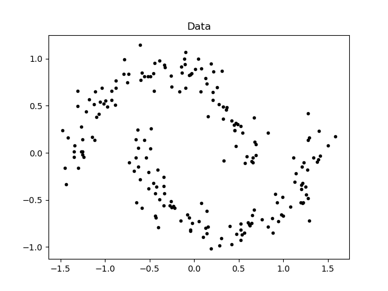
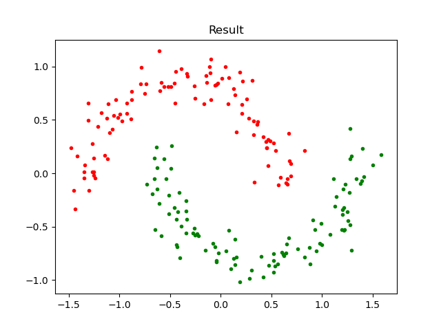

# Assignment-5

<center> 黎郡 2020E8017782051
</center>


## Question

关于谱聚类。有如下 200 个数据点,它们是通过两个半月形分布生成的。如图所示:

<div align=center>
    
</div>


* 请编写一个谱聚类算法,实现"Normalized Spectral Clustering—Algorithm 3 (Ng 算法)".
* 设点对亲和性(即边权值)采用如下计算公式:

$$
w_{ij} = e^{-\frac{||x_i-x_j||^2_2}{2\sigma^2}}
$$

- 数据图采用 k-近邻方法来生成(即对每个数据点$x_i$,首先在所有样本中找出不包含$x_i$的 k 个最邻近的样本点,然后$x_i$与每个邻近样本点均有一条边相连,从而完成图构造)。

> 注意,为了保证亲和度矩阵 W 是对称矩阵,可以令$W=\frac{(W^{T} +W)}{2}$. 假设已知前 100 个点为一个聚类, 后 100 个点为一个聚类,请分析分别取不同的$\sigma$值和 k 值对聚类结果的影响。
> (本题可以给出关于聚类精度随着$\sigma$值和 k 值的变化曲线。在实验中,可以固定一个,变化另一个).

- 附注 ：聚类精度 Accu 计算如下： 

  > $$
  > Accu=\frac{n_1+n_2}{n}
  > $$
  >
  > 其中，$n_1$表示正确的属于第一个聚类的样本点的个数；$n_2$表示正确的属于第二个聚类 的样本点的个数；n 表示样本点的总数。


## Answer 

##### 实现思路

* 数据加载函数: 从指定txt文件中读取实验数据.
* 图构造函数: 基于输入的数据和参数构造图, 图构造时首先计算每个样本点到其他样本点的距离, 利用K近邻方法生成图, 进而基于亲和性公式生成亲和性矩阵.
* 谱聚类(Ng算法)函数: 基于输入的实验数据亲和性矩阵, 依次计算D, L 和 $L_{sym}$, 进而求取$L_{sym}$的最小的前c个特征值对应的特征向量, 归一化后作为样本新特征, 利用K-means实现最终聚类.
* K-means聚类算法

##### 实验结果分析

运行spectral_clustering.py即可得到如下结果。

调整参数后谱聚类效果如图所示. 当$k=5, \sigma=2$时, 分类完全正确, 其可视化结果如下图所示:




探究不同的k值和$\sigma$值对聚类结果的影响。实验时, 保持其他参数不变(固定K-means初始化值), 固定k和$\sigma$中的一个, 改变另一个, 观察聚类结果(精度)的变化.

- 当固定$\sigma=2$时, 当$k \in (5,15)$时能完全正确分类。但随着 k 的增大，Acc 逐渐降低，最终维持在0.75左右。这是因为当 k 较大时，图两部分的样本点可能会产生连接的边，此时图不再是二部图，要将其分离就更加困难


- 固定$k=10或50$，$\sigma$值在不同的k值大小下，变化有所区别。

  - 当 $k=10$，$\sigma$ 值得增大并不影响结果得正确性，分类一直正确

    

  - 当$k=100$时, 随$\sigma$增大, 聚类精度下降, 这是因为k 较大时，太大的 σ 可能会强化两个连通域之间的连边. 导致准确率的下降。

    

有上述实验结果可以看出, 图的构造对谱聚类的最终结果影响很大, 只有选择合适的k近邻数和亲和性系数才能得到较好的谱聚类结果.

#### 实验代码

```python
import numpy as np
import matplotlib.pyplot as plt


def load_data(file_name):
    """
    加载数据
    :param file_name: 文件路径
    :return:
    """
    data = []
    with open(file_name, 'r') as f:
        content = f.readlines()
        for i in content:
            i = i[:-1].split(" ")
            data.append([float(i[0]), float(i[1])])
    data = np.array(data)

    return data


def generate_graph(data, k, sigma):
    """
    构造图
    Parameter:
        data: 待聚类数据
        k: k近邻数
        sigma: 亲和性参数
    Return:
        w: 亲和性矩阵
    """
    # 构造data行列矩阵(n*n*d)以便后续矩阵运算: data_c每列相同 = data_r每行相同 = 样本数据
    data_c = np.tile(np.expand_dims(data.copy(), axis=1), (1, data.shape[0], 1))
    data_r = np.tile(np.expand_dims(data.copy(), axis=0), (data.shape[0], 1, 1))

    # 生成Dist矩阵
    dist = np.sum((data_c - data_r) ** 2, axis=-1)

    # 生成W矩阵
    # 初始化w
    w = np.zeros_like(dist)
    for idx_sample, i in enumerate(dist):
        idx = np.arange(0, i.shape[0])
        # 构造 距离-索引 序列, 将距离和索引一一对应
        i_idx = zip(i, idx)
        # 按照距离递增排序
        i_sorted = sorted(i_idx, key=lambda i_idx: i_idx[0])
        # 生成w矩阵: 循环时排除自身距离为0的干扰
        for j in range(1, k + 1):
            w[idx_sample, i_sorted[j][1]] = np.exp(-i_sorted[j][0] / (2 * (sigma ** 2)))
    # w调整:为保证w为对称矩阵
    w = (w.T + w) / 2

    return w


def k_means(data, mu):
    """
    K-means聚类
    :param data: 待聚类数据(np.array)
    :param mu:  初始化聚类中心(np.array)
    :return:
        class_result: 聚类结果[[第一类数据], [第二类数据], ... , [第c类数据]]
        label: 分类结果
        mu: 类中心结果[第一类类中心, 第二类类中心, ... , 第c类类中心]
        iter_num: 迭代次数
    """
    # 待聚类数据矩阵调整(复制矩阵使其从n*d变为n*c*d, c为中心点mu的数目)
    # (1000, 2)->(1000, 5, 2)
    global class_result, label
    data = np.tile(np.expand_dims(data, axis=1), (1, mu.shape[0], 1))
    mu_temp = np.zeros_like(mu)  # 保存前一次mu的结果
    iter_num = 0

    while np.sum((mu - mu_temp) ** 2):
        mu_temp = mu
        iter_num += 1
        label = np.zeros((data.shape[0]), dtype=np.uint8)

        # 调整矩阵mu与data的格式一致 (5, 2)->(1000, 5, 2)
        mu = np.tile(np.expand_dims(mu, axis=0), (data.shape[0], 1, 1))
        # 生成距离矩阵(1000, 5)
        dist = np.sum(pow((data - mu), 2), axis=-1)

        class_result = []  # 是五个类别
        for i in range(data.shape[1]):
            class_result.append([])

        for index, sample in enumerate(data):
            minDist_index = np.argmin(dist[index])
            # sample为五个重复的数据，所以取第一个就行了
            class_result[minDist_index].append(sample[0])
            label[index] = minDist_index
        class_result = np.array(class_result)
        mu = []
        for i in class_result:
            new_mean = np.mean(i, axis=0)
            mu.append(new_mean)
        mu = np.array(mu)

    return class_result, label, mu, iter_num


def ng_algo(W, c):
    """
    Ng谱聚类算法
    Parameters:
        W: 亲和性矩阵
        c: 聚类类别数
    Return:
        label: 聚类结果label列表 [样本1类别, 样本2类别, ... , 样本n类别]
    """
    # 计算D & D^(-1/2)矩阵: 为避免生成D后计算会出现分母为0的情况, 直接计算D^(-1/2)
    W_rowsum = np.sum(W, axis=1)
    D = np.diag(W_rowsum)
    # W_rowsum = 1/(np.sqrt(W_rowsum))
    W_rowsum = W_rowsum ** (-0.5)
    D_invsqrt = np.diag(W_rowsum)
    # 计算L矩阵
    L = D - W
    # 计算L_sym矩阵
    L_sym = np.matmul(np.matmul(D_invsqrt, L), D_invsqrt)
    # L_sym特征值 & 特征向量
    e_value, e_vector = np.linalg.eig(L_sym)
    e_vector = e_vector.T
    e = zip(e_value, e_vector)
    e_sorted = sorted(e, key=lambda e: e[0])
    # 生成新特征
    new_feature = []
    for i in range(c):
        new_feature.append(e_sorted[i][1])
    new_feature = np.array(new_feature).T
    # 归一化新特征
    norm_feature = []
    for i in new_feature:
        i = i / (np.sqrt(np.sum(i ** 2)) + 1e-10)
        norm_feature.append([i[0], i[1]])
    norm_feature = np.array(norm_feature)
    # 对新特征做K-means
    mu = np.array([norm_feature[50], norm_feature[150]])
    _, label, _, _ = k_means(norm_feature, mu)

    return label


if __name__ == "__main__":
    # 加载数据
    data = load_data("./data.txt")
    gt = np.zeros((200))
    for i in range(100, 200): gt[i] = 1

    # 可视化原始数据
    plt.scatter(data[:, 0], data[:, 1], marker=".", color="black")
    plt.title("Data")
    plt.savefig('data.png')
    plt.show()

    # 构造图，得到亲和矩阵。并可视化此结果
    k = 5
    sigma = 2
    w = generate_graph(data, k, sigma)
    c = 2
    label = ng_algo(w, c)
    color = ['red', 'green']
    for idx, i in enumerate(data):
        i = np.array(i)
        plt.scatter(i[0], i[1], marker='.', color=color[label[idx]])
    plt.title('Result')
    plt.savefig('k=5_sigma=2.png')
    plt.show()

    # 分析固定sigma=2, k取[1,100]的正确率
    Acc = []
    for k in range(1, 100):
        sigma = 2
        w = generate_graph(data, k, sigma)
        label = ng_algo(w, c)
        acc = (200 - np.sum(np.abs(label - gt))) / 200
        Acc.append(acc)
    Acc = np.array(Acc)
    plt.plot(np.arange(1, 100), Acc)
    plt.title("Acc-k (sigma={})".format(sigma))
    plt.xlabel("k")
    plt.ylabel("Acc")
    name = 'change_k.png, sigma=' + str(sigma) + '.png'
    plt.savefig(name)
    plt.show()

    # 固定k,变化sigma
    Acc = []
    for sigma in np.arange(0.1, 3, 0.1):
        k = 100
        w = generate_graph(data, k, sigma)
        label = ng_algo(w, c)
        acc = (200 - np.sum(np.abs(label - gt))) / 200
        Acc.append(acc)
    Acc = np.array(Acc)
    plt.plot(np.arange(0.1, 3, 0.1), Acc)
    plt.title("Acc-Sigma (k={})".format(k))
    plt.xlabel("sigma")
    plt.ylabel("Acc")
    name = 'change_sigma, k='+str(k)+'.png'
    plt.savefig(name)
    plt.show()

```

